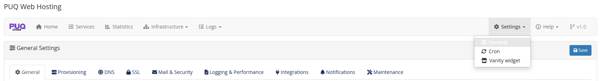

# Requirements & Installation

### PUQ Web Hosting module **[WHMCS](https://puqcloud.com/link.php?id=77)**
#####  [Order now](https://puqcloud.com/whmcs-module-web-hosting.php) | [Download](https://download.puqcloud.com/WHMCS/servers/PUQ_WHMCS-WEB-Hosting/) | [Community](https://community.puqcloud.com/)

## Requirements

* A working **WHMCS** installation (see the PHP/WHMCS compatibility table below).
* **ionCube Loader** enabled on the WHMCS host, matching the PHP version it runs.
* One or more **HestiaCP** servers reachable over **SSH** from the WHMCS host. The module drives Hestia entirely over SSH (the panel HTTP API is not required); set up `sudo` NOPASSWD for the management user, or use the Hestia `admin` user with key/password auth.
* (Optional) **PowerDNS** servers if you want PowerDNS as a DNS backend alongside HestiaCP.
* Outbound HTTPS from the Hestia nodes for Let's Encrypt and for the optional file‑manager / PHP installers.

## PHP & WHMCS compatibility

The module is distributed as **ionCube‑encoded builds, one per PHP version: 7.4, 8.1 and 8.2.** Always install the build that matches the **PHP version your WHMCS host runs under** — not the PHP versions you offer to hosting customers (those are independent and managed on each Hestia web server).

| WHMCS version | PHP it runs on | Module build to install |
|---------------|----------------|-------------------------|
| **WHMCS 8.x** | 7.4, 8.1 or 8.2 | the **7.4 / 8.1 / 8.2** build matching your PHP |
| **WHMCS 9.x** | 8.2 | the **8.2** build |
| any host on **PHP 8.3 / 8.4 or newer** | 8.3+ | the **8.2** build |

**How to choose, in plain terms:**

1. Check the PHP version your WHMCS server runs (WHMCS → *Utilities → System → PHP Info*, or `php -v` on the host).
2. On **WHMCS 8** you may run PHP **7.4, 8.1 or 8.2** — download the build with the same number.
3. On **WHMCS 9** the host runs PHP **8.2** — use the **8.2** build.
4. If your host runs a PHP version **newer than 8.2** (8.3, 8.4, …), use the **8.2 build** — it is the latest supported and is compatible with newer PHP runtimes.

## Download

The module is distributed as **ionCube‑encoded ZIP builds — one per supported PHP major version (7.4, 8.1, 8.2)**. Pick the build that matches the PHP version your **WHMCS host** runs (see the compatibility table above), then download it.

All versions and historical builds are in the index:

- [https://download.puqcloud.com/WHMCS/servers/PUQ_WHMCS-WEB-Hosting/](https://download.puqcloud.com/WHMCS/servers/PUQ_WHMCS-WEB-Hosting/)

### Direct "latest" downloads

#### PHP 8.2

```bash
wget https://download.puqcloud.com/WHMCS/servers/PUQ_WHMCS-WEB-Hosting/php82/PUQ_WHMCS-WEB-Hosting-latest.zip
```

#### PHP 8.1

```bash
wget https://download.puqcloud.com/WHMCS/servers/PUQ_WHMCS-WEB-Hosting/php81/PUQ_WHMCS-WEB-Hosting-latest.zip
```

#### PHP 7.4

```bash
wget https://download.puqcloud.com/WHMCS/servers/PUQ_WHMCS-WEB-Hosting/php74/PUQ_WHMCS-WEB-Hosting-latest.zip
```

> Not sure which PHP version your WHMCS runs on? Check **Utilities → System → PHP Info** in the WHMCS admin area. On hosts running PHP **8.3 / 8.4 or newer**, use the **8.2** build (it is the latest supported and runs on newer PHP).

### Unzip the archive

On your WHMCS server (or locally, before uploading):

```bash
unzip PUQ_WHMCS-WEB-Hosting-latest.zip
```

The archive extracts into a `PUQ_WHMCS-WEB-Hosting/` directory containing the two module folders: `puqWebHosting` (server module) and `puq_web_hosting` (addon module).

> After any module update, re‑run the schema check (below).

## Install both modules

The product is **two** WHMCS modules — install both:

| Upload to | Module |
|-----------|--------|
| `modules/servers/puqWebHosting/` | the **server module** |
| `modules/addons/puq_web_hosting/` | the **addon module** |

Then in WHMCS go to **Setup → Addon Modules**, find **PUQ Web Hosting**, and **Activate** it (grant access to the admin roles that should manage hosting). Activating the addon creates the database tables the server module needs.

## First run: check the schema & find the panels

After activation you have a new **PUQ Web Hosting** admin page (via *Addons*). Its top navigation gives you everything: **Home, Services, Statistics, Infrastructure, Logs, Settings, Help**.



Open **Settings → Maintenance** and click **Run schema check** once. It scans every module table and brings it in sync with the current code — creating missing tables, adding missing columns and dropping columns that no longer exist. You should run this after every module update.


> The same tab has a *“delete all tables on deactivate”* toggle — leave it **off** unless you are fully uninstalling, so your data survives an accidental deactivation.

## What's next

With both modules installed you build your service from the bottom up:

1. **Add your servers** and tag their capabilities — see *Add web / mail / DNS servers*.
2. **Group them** and apply role‑targeted configuration — see *Server groups*.
3. **Create a product** pointed at a group — see *Create a product*.

The module **Settings** (timeouts, retry policy, SSL cadence, DNS/SOA defaults, integrations, notifications) are covered in *Addon Module → Settings*; the defaults are sensible, so you can come back to them later.
