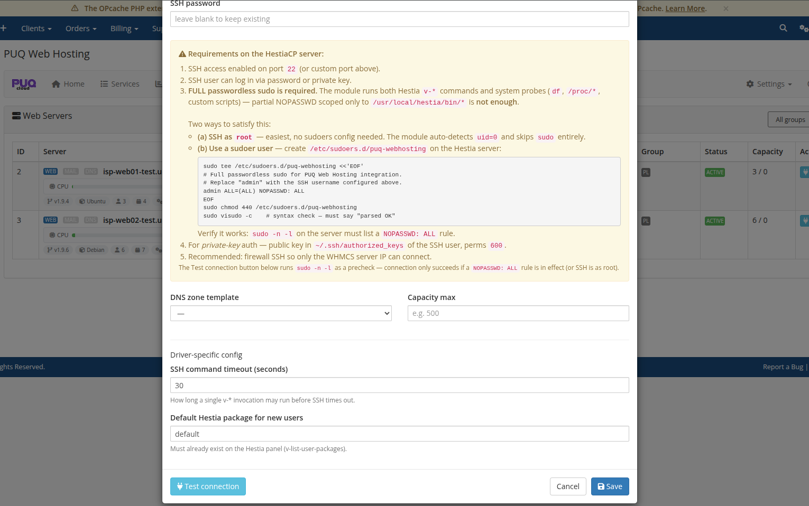

# Add Web / Mail / DNS Servers

### PUQ Web Hosting module **[WHMCS](https://puqcloud.com/link.php?id=77)**
#####  [Order now](https://puqcloud.com/whmcs-module-web-hosting.php) | [Download](https://download.puqcloud.com/WHMCS/servers/PUQ_WHMCS-WEB-Hosting/) | [Community](https://community.puqcloud.com/)

Your fleet is managed under **Infrastructure**. The same physical servers appear under **Web Servers**, **Mail Servers** and **DNS Servers** filtered by the capabilities you give them.

Each row shows live **CPU / RAM / Disk / Load**, the Hestia version & OS, the panel‑OK indicator, the group, the capacity used/max and the row actions. A green **OK** means the SSH/panel probe succeeded.

## Add a server

Click **Add Web Server** (or Mail/DNS — they open the same editor) and fill in the connection details:

| Field | Notes |
|-------|-------|
| **Capabilities** | Tick **Web**, **Mail**, **DNS** — one, two or all three. This decides which pools the node appears in and which roles can be placed on it. |
| **Driver** | `HestiaCP` (or `PowerDNS` for a DNS‑only node). |
| **Status** | `active` to use it. |
| **Hostname / IP / SSH port** | The SSH endpoint. |
| **SSH auth** | Password or private key. |

Lower in the editor you set per‑server defaults:

* **DNS zone template** — the template used for zones created on/for this node.
* **Capacity max** — soft capacity used for least‑loaded placement.
* **SSH command timeout** — override for slow nodes.
* **Default Hestia package** for new users.

Use **Test connection** before saving; the row will then show **OK** and start reporting live stats.

## Capabilities = your topology

How you tick capabilities **is** your segmentation plan:

* **One node, all roles** → tick Web + Mail + DNS on a single server (great for starting out).
* **Web/mail split** → some nodes tick **Web** only, dedicated nodes tick **Mail** only.
* **Three tiers** → separate Web, Mail and **DNS** (nameserver) pools.

DNS servers are a special case — they are **independent** and attached to groups (one DNS server can serve many groups). The DNS Servers page reminds you of this:

> See **Deployment & Segmentation → Server segmentation** for the full reasoning and the role‑targeted configuration that goes with these capabilities. The next page groups these servers so a product can sell from them.
