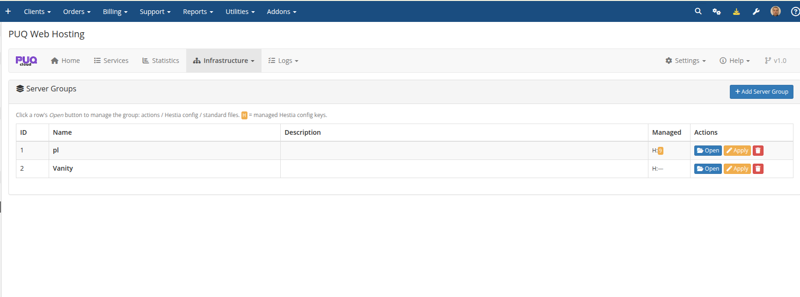
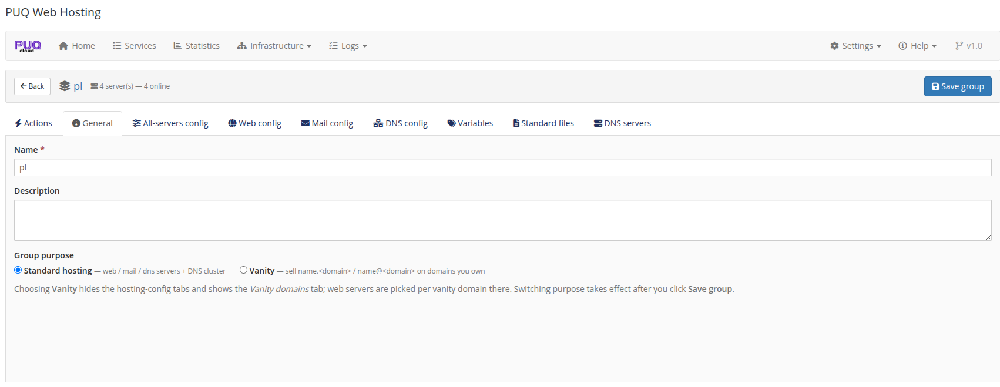

# Server Groups

### PUQ Web Hosting module **[WHMCS](https://puqcloud.com/)**
#####  [Order now](https://puqcloud.com/) | [Download](https://download.puqcloud.com/WHMCS/servers/PUQ_WHMCS-WEB-Hosting/) | [FAQ](https://faq.puqcloud.com/)

A **server group** bundles a set of nodes together. A WHMCS product points at one group, and the module places each service's roles on the group's capable nodes. Groups are managed under **Infrastructure → Server Groups**.

Click **Open** on a row to manage the group. The **H:** badge shows how many `hestia.conf` keys the group manages.

## Group purpose: Standard vs Vanity

The first decision, on the group's **General** tab, is **Group purpose**:

* **Standard hosting** — web / mail / DNS servers + a DNS cluster. Used by Split and Unified products.
* **Vanity** — sell `name.<domain>` / `name@<domain>` on domains you own. Choosing this hides the hosting‑config tabs and shows the **Vanity domains** tab. (See the dedicated **Vanity Mode** chapter.)

## Attach DNS servers (the cluster)

On the group's **DNS servers** tab, tick the nameservers this group replicates zones to. DNS servers are independent and shared — one server can back many groups. Every zone for the group is pushed to **every** attached DNS node (active‑active).

This tab is also where you set the group's **default DNS zone template** and **SOA defaults** for new zones.

## Apply configuration

The group's **Actions** tab lets you push the managed Hestia configuration and standard files to the members, per role (all / web‑only / mail‑only / DNS‑only). The detail of role‑targeted config (`hestia.conf` management, drift, standard files) is covered in **Addon Module → Server‑group editor** and **Deployment & Segmentation → Server segmentation**.

> A minimal setup is **one group** containing your nodes. As you grow, use multiple groups to separate locations/tiers or to offer different SLAs, and a separate **Vanity** group for your name‑selling offers.
