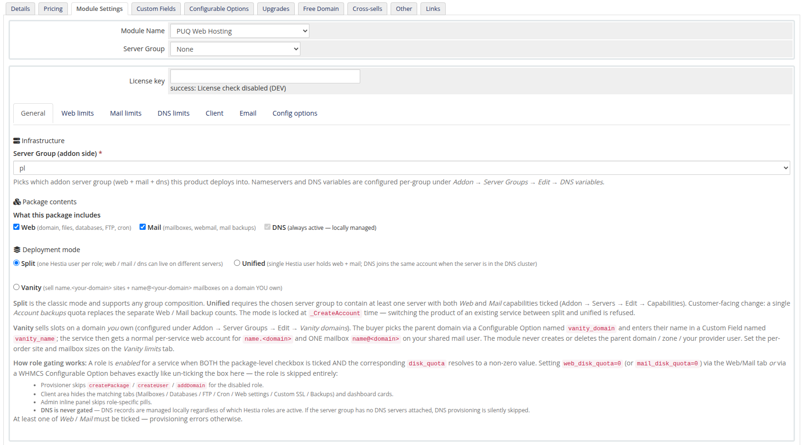
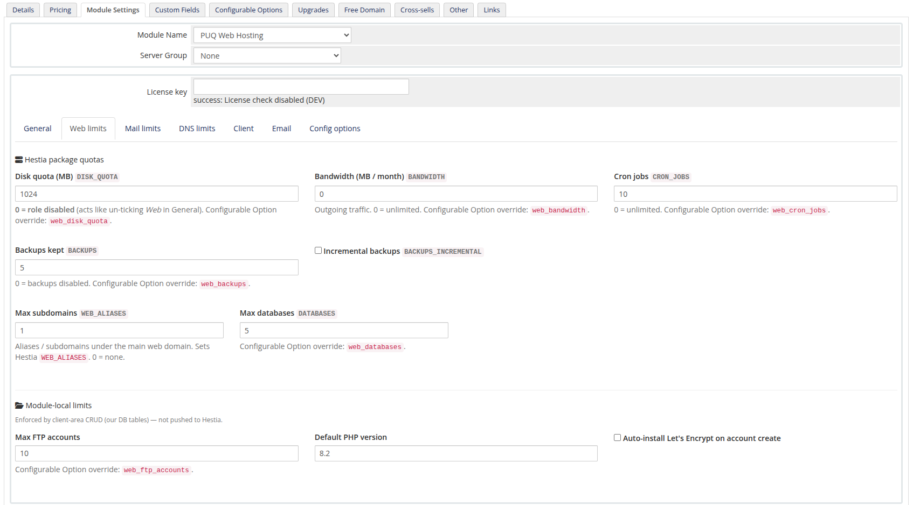
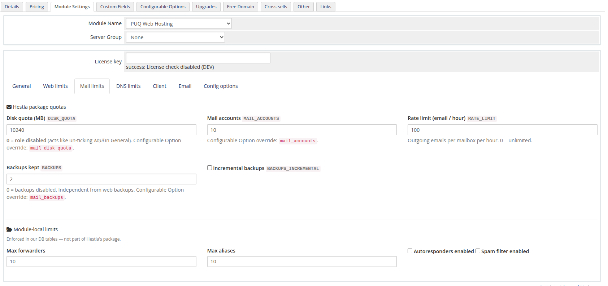
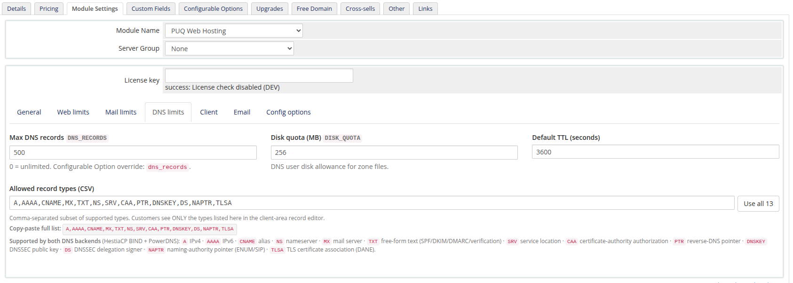
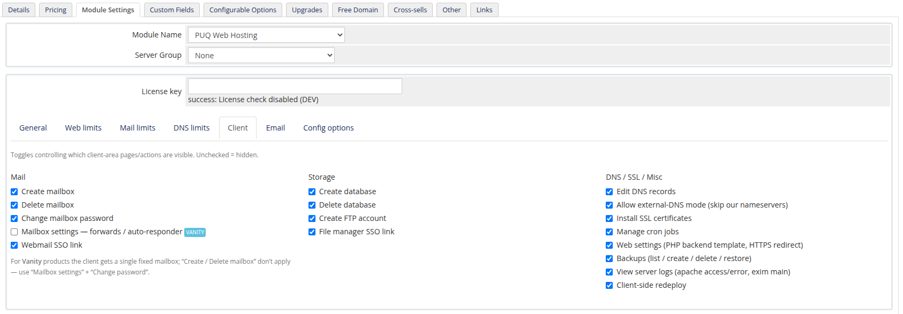
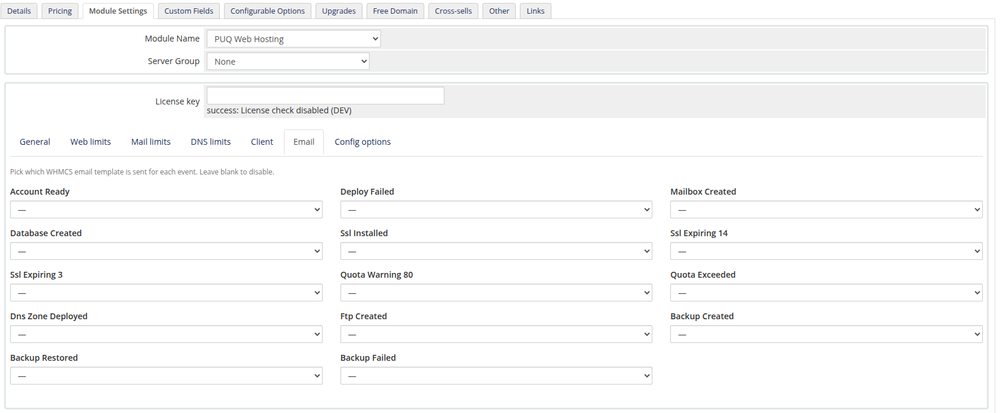
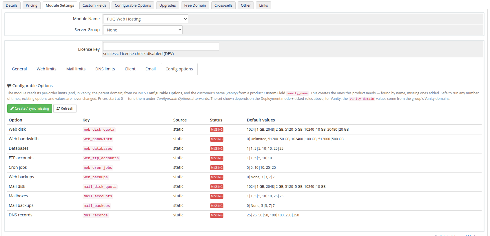
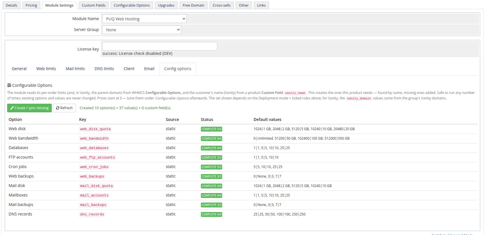

# Create a Product

### PUQ Web Hosting module **[WHMCS](https://puqcloud.com/)**
#####  [Order now](https://puqcloud.com/) | [Download](https://download.puqcloud.com/WHMCS/servers/PUQ_WHMCS-WEB-Hosting/) | [FAQ](https://faq.puqcloud.com/)

Create a product in WHMCS (*Setup → Products/Services*), then on **Module Settings** choose **PUQ Web Hosting** and point **Server Group** at the group you built.

The configuration lives on a row of sub‑tabs: **General · Web limits · Mail limits · DNS limits · Client · Email · Config options** (in Vanity mode the limits tabs collapse to a single **Vanity limits** tab).

## General — roles & deployment mode

On **General** you pick which **roles** the package includes (tick **Web / Mail / DNS**) and the **Deployment mode** (**Split / Unified / Vanity** — see **Deployment & Segmentation → Deployment models**).

## Limits — what the customer gets

The **Web / Mail / DNS limits** tabs define the Hestia package quotas and the module‑local caps for each ticked role. Every field maps to a **Configurable Option override key** (e.g. `web_disk_quota`) so you can offer upgradeable tiers.

* **Web limits** — disk, bandwidth, cron jobs, backups kept, max subdomains (`WEB_ALIASES`), max databases, max FTP accounts, default PHP version, auto‑install Let's Encrypt.

  
* **Mail limits** — mail disk, mail accounts, outbound rate limit/hour, mail backups (independent of web), max forwarders, max aliases, autoresponders/spam‑filter.

  
* **DNS limits** — max DNS records, DNS disk quota, default TTL, and the **allowed record types** the customer may use (A, AAAA, CNAME, MX, TXT, NS, SRV, CAA, PTR, DNSKEY, DS, NAPTR, TLSA — on both HestiaCP BIND and PowerDNS).

  

> Setting a role's disk quota to `0` disables that role for the product (the same as un‑ticking it on General).

## Client — what the customer can do

The **Client** tab is a set of toggles controlling which client‑area pages/actions are visible — create/delete mailbox, change password, create database/FTP, edit DNS, install SSL, manage cron, web settings, backups, view logs, client‑side redeploy, file‑manager & webmail SSO. Untick to hide.

## Email — lifecycle emails

The **Email** tab maps a WHMCS email template to each module event (Account Ready, Deploy Failed, Mailbox/Database/FTP/Backup Created, SSL Installed, SSL Expiring 14/3, Quota Warning 80/Exceeded, DNS Zone Deployed, Backup Restored/Failed). Leave an event blank to disable it.

## Config options — wire up WHMCS

Finally, open **Config options** and click **Create / sync missing**. The module reads its per‑order limits from WHMCS **Configurable Options**; this button creates exactly the ones the product needs (it's safe to run repeatedly — existing options and values are never changed).

After syncing they show **COMPLETE**:

Tune the **prices** afterwards under WHMCS *Configurable Options*. The product is now ready to order.

> For a **Vanity** product the limits and config‑options are different (Website/Mailbox quota + the `vanity_domain` option + `vanity_name` custom field). See **Vanity Mode → The vanity product**.
