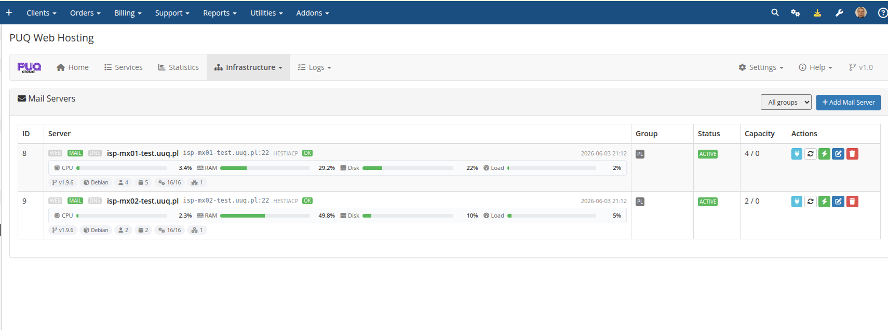
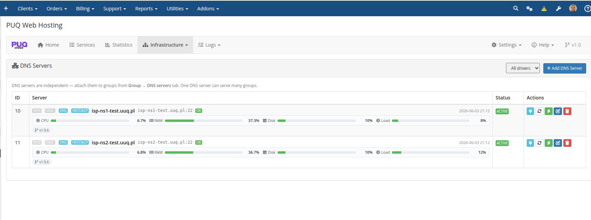

# Infrastructure: Servers

### PUQ Web Hosting module **[WHMCS](https://puqcloud.com/link.php?id=77)**
#####  [Order now](https://puqcloud.com/whmcs-module-web-hosting.php) | [Download](https://download.puqcloud.com/WHMCS/servers/PUQ_WHMCS-WEB-Hosting/) | [Community](https://community.puqcloud.com/)

**Infrastructure** is where you register and monitor every node. The same servers are presented under three filtered lists — **Web**, **Mail** and **DNS** — based on their capabilities.

Each row carries live **CPU / RAM / Disk / Load** bars, the panel‑OK probe, the Hestia version & OS, the group, the capacity used/max, and per‑row actions (open Server Actions, refresh status, sync, edit, delete).

## Capabilities decide the pools

A node's **Web / Mail / DNS** capability flags decide which list it appears in and which roles can be placed on it. See **Add web / mail / DNS servers** for the editor and **Deployment & Segmentation → Server segmentation** for how to design your topology.

DNS servers are independent and attached to groups (one server can serve many groups):

## Open a server → Server Actions

Clicking a server's open/manage action takes you to the **Server Actions** page for that node — a full per‑node management console (live config, group‑config drift, PHP versions, file‑manager installs, system services, Hestia users & packages, IPs, maintenance, logs). That page is documented next.
