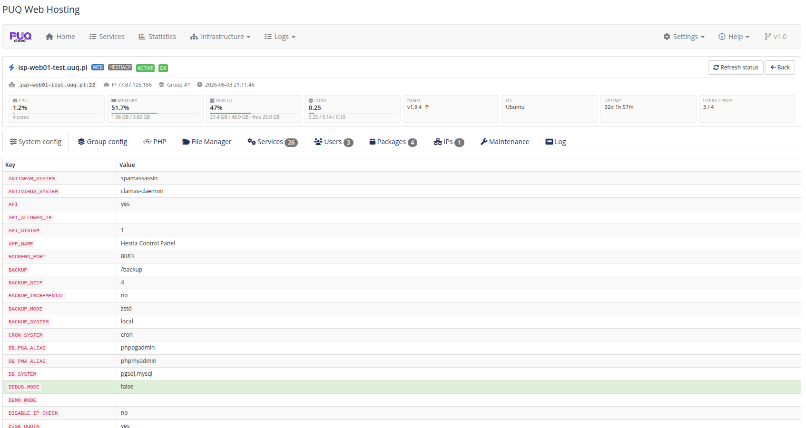
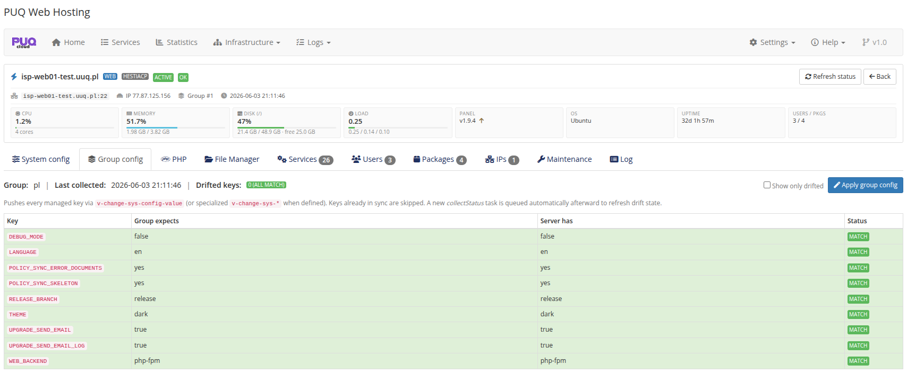
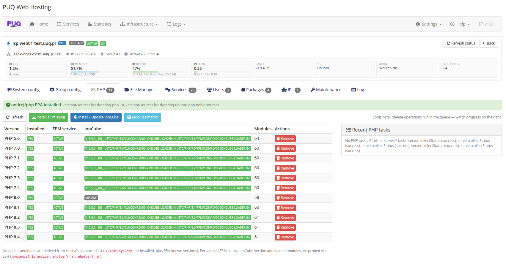
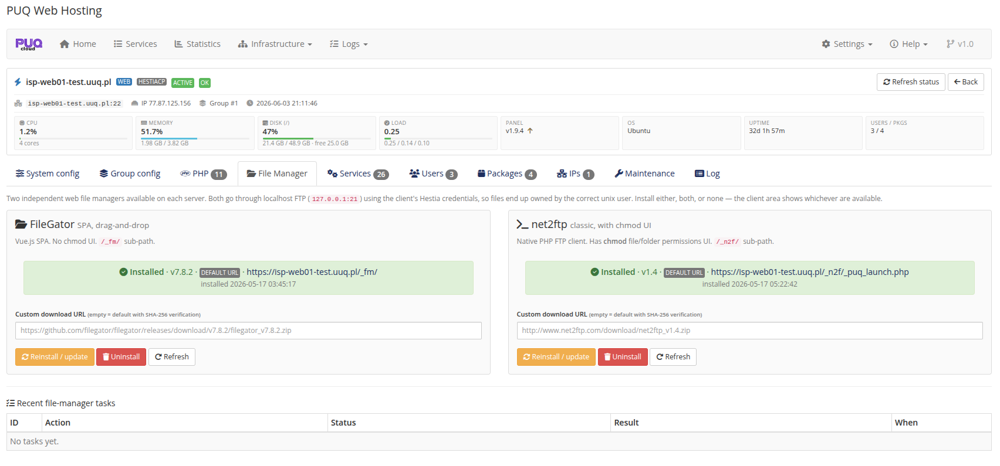
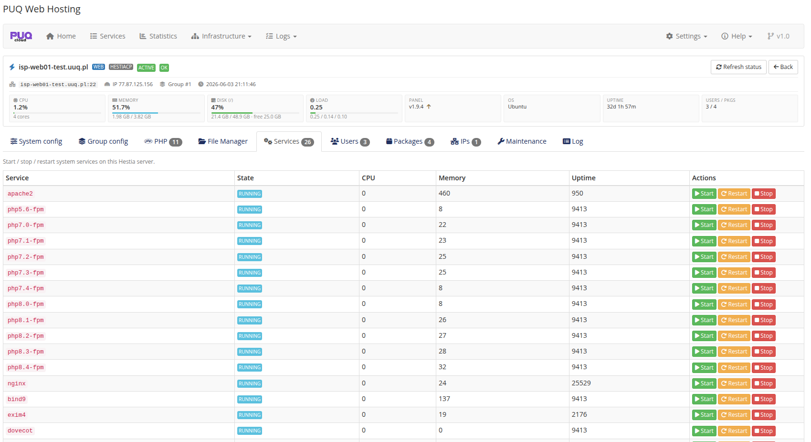
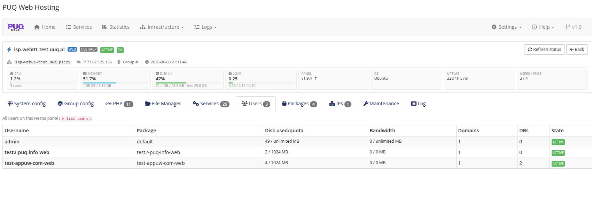
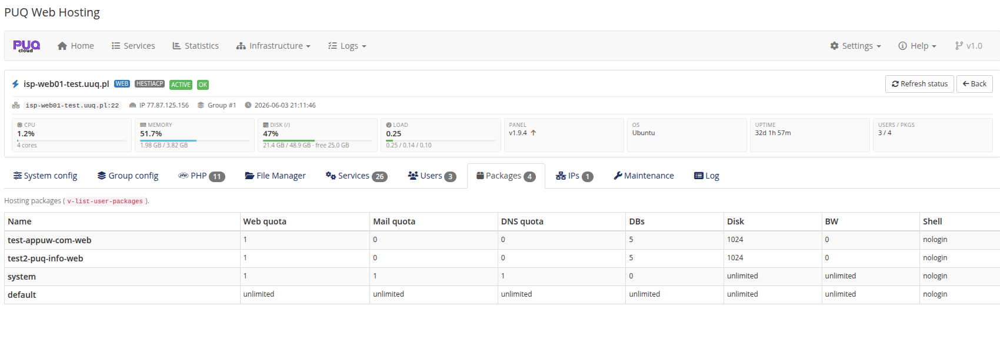
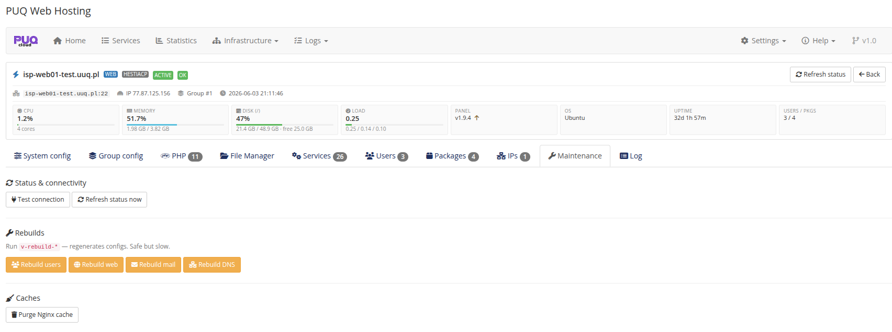
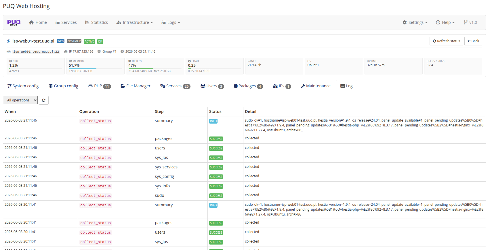

# Server Actions (per node)

### PUQ Web Hosting module **[WHMCS](https://puqcloud.com/)**
#####  [Order now](https://puqcloud.com/) | [Download](https://download.puqcloud.com/WHMCS/servers/PUQ_WHMCS-WEB-Hosting/) | [FAQ](https://faq.puqcloud.com/)

Opening a server gives you a per‑node console with live stat cards and a tab bar: **System config · Group config · PHP · File Manager · Services · Users · Packages · IPs · Maintenance · Log**.

## System config

A live, read‑only dump of the node's `hestia.conf` key/value pairs — handy for confirming what a server is actually running.

## Group config (drift)

Compares the node's live config against what its **group** expects, key by key, with a **MATCH / drift** status, and lets you **Apply group config** to push the managed values:

This is the per‑node view of the group's managed `hestia.conf` (see *Server‑group editor*).

## PHP

Install / remove PHP versions (5.6 – 8.4) with their FPM service, IonCube, and the Ondrej/Sury repositories — with an online gate and a recent‑tasks panel.

## File Manager

Install and manage the two built‑in file managers per node — **FileGator** (Vue SPA, drag‑and‑drop) and **net2ftp** (native chmod UI). Each shows its installed version & URL, a custom download URL, and Reinstall / Uninstall / Refresh.

## Services / Users / Packages

* **Services** — system services (apache2, php‑*‑fpm, exim4, dovecot, nginx, bind9…) with state/CPU/memory/uptime and start/stop/restart.

  
* **Users** — every Hestia user on the node with its package, disk used/quota, bandwidth, domains, DBs and state.

  
* **Packages** — the Hestia hosting packages on the node (the module creates a per‑service package automatically).

  

## Maintenance & Log

* **Maintenance** — Test connection / Refresh status, rebuild commands (`v‑rebuild‑*` for users/web/mail/DNS), and Purge Nginx cache.

  
* **Log** — the operation log filtered to this one node.

  
