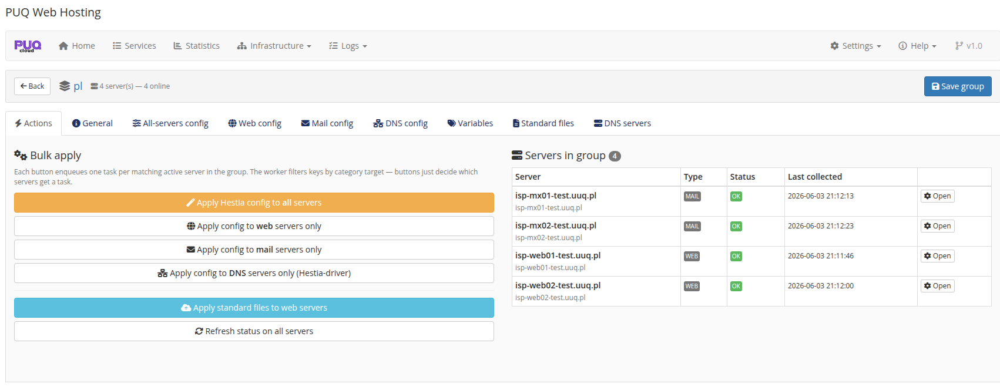
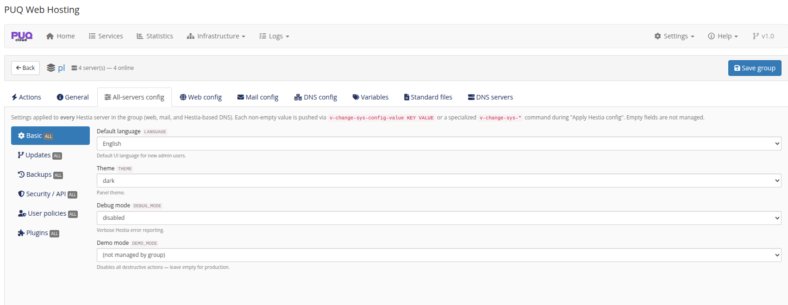
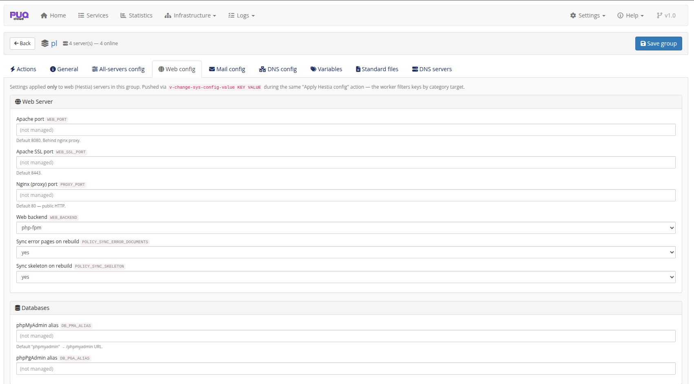
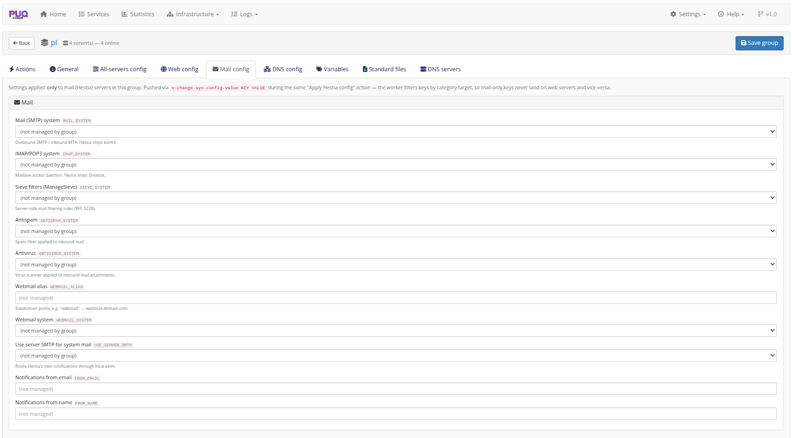
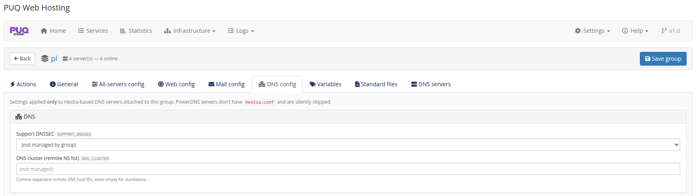
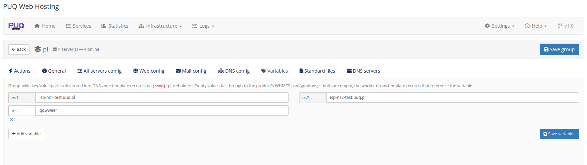
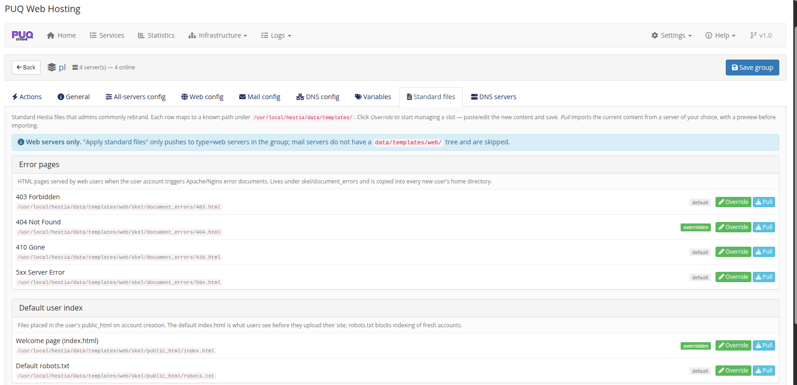
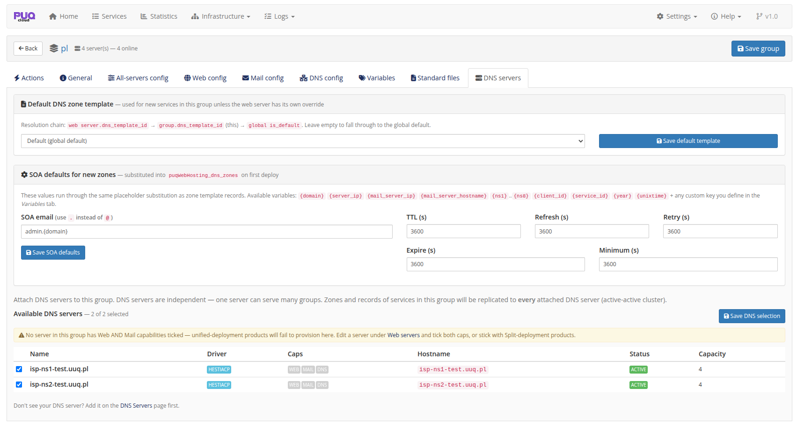

# Server‑Group Editor

### PUQ Web Hosting module **[WHMCS](https://puqcloud.com/link.php?id=77)**
#####  [Order now](https://puqcloud.com/whmcs-module-web-hosting.php) | [Download](https://download.puqcloud.com/WHMCS/servers/PUQ_WHMCS-WEB-Hosting/) | [FAQ](https://faq.puqcloud.com/)

Open a group (Infrastructure → Server Groups → **Open**) to manage its members, its centrally‑managed `hestia.conf`, its DNS cluster and (for vanity groups) its sellable domains. A standard group has these tabs: **Actions · General · All‑servers config · Web config · Mail config · DNS config · Variables · Standard files · DNS servers**.

## Actions — bulk apply per role

The Actions tab lists the members with their **Type** and **Status**, and pushes config/files **per role**: *Apply Hestia config to all / web only / mail only / DNS only*, *Apply standard files to web*, *Refresh status*. Applying enqueues one task per matching active node.

## General — name & purpose

Name, description and the **Group purpose** (Standard vs Vanity). See **Server Groups** and the **Vanity Mode** chapter.

## Managed `hestia.conf` (role‑targeted)

The module can centrally manage Hestia config keys and keep every node in sync (with drift detection on the node's *Group config* tab). The keys are split by role so they only ever land on the right tier:

* **All‑servers config** — applied to every node (language, theme, security/API, user policies, plugins…).

  
* **Web config** — web‑only (Apache/SSL/Nginx ports, web backend, sync error pages/skeleton, phpMyAdmin/phpPgAdmin aliases).

  
* **Mail config** — mail‑only (SMTP/IMAP/Sieve systems, antispam/antivirus, webmail, use‑server‑SMTP, notification from‑address).

  
* **DNS config** — Hestia‑DNS‑only (DNSSEC, DNS cluster / remote NS list). PowerDNS nodes have no `hestia.conf` and are skipped.

  

Empty fields are **not managed** — the module only pushes the keys you fill in.

## Variables

Group‑wide `{name}` key/value pairs substituted into DNS zone template records (e.g. `ns1`, `ns2`). Empty values fall through to the product's WHMCS configoptions; if both are empty the worker drops template records that reference the variable.

## Standard files (rebranding)

Rebrandable Hestia skeleton files for **web** nodes — error pages (403/404/410/5xx), the default user `index.html` / `robots.txt`, the suspended‑account page, and the unassigned‑IP vhost. Each can be **Overridden** (your content) or **Pulled** from a server, with default/overridden badges.

## DNS servers (the cluster)

Attach independent DNS servers to the group (active‑active replication) and set the group's default zone template + SOA defaults.

> A **Vanity** group shows only General / Variables / DNS servers / **Vanity domains** — the hosting‑config tabs are hidden. See **Vanity Mode → Setting up the vanity group**.
