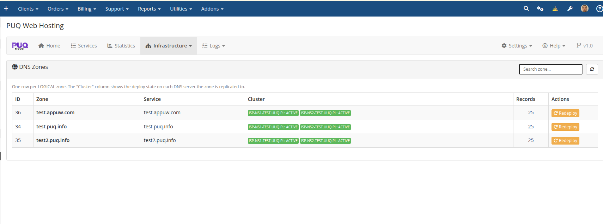
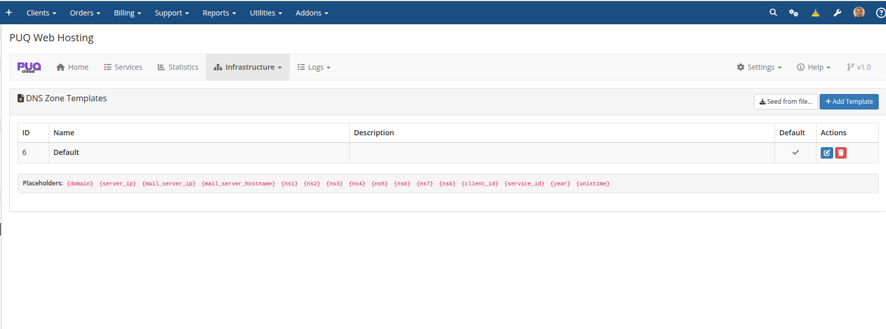
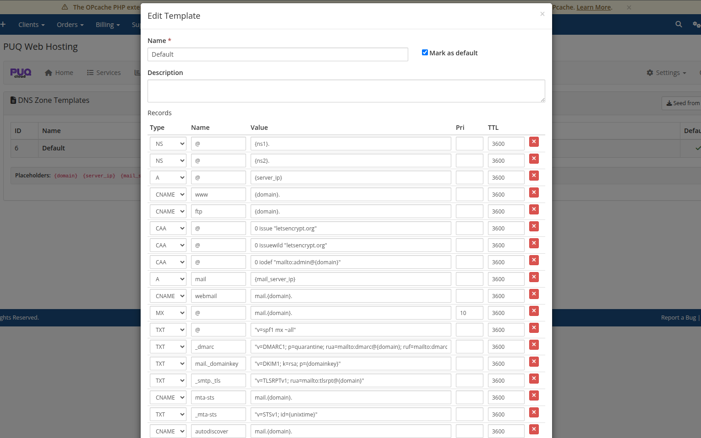

# DNS Zones & Templates

### PUQ Web Hosting module **[WHMCS](https://puqcloud.com/link.php?id=77)**
#####  [Order now](https://puqcloud.com/whmcs-module-web-hosting.php) | [Download](https://download.puqcloud.com/WHMCS/servers/PUQ_WHMCS-WEB-Hosting/) | [Community](https://community.puqcloud.com/)

## DNS Zones

Infrastructure → **DNS Zones** lists every **logical** zone (one row per zone). The **Cluster** column shows the per‑DNS‑server deploy state, so you can see at a glance that a zone is live on every nameserver. A **Redeploy** action re‑pushes the zone.

Because zones are logical and replicated, the module gives you an **active‑active** nameserver cluster — the same zone is served identically by every attached DNS node.

## DNS Zone Templates

Infrastructure → **DNS Zone Templates** holds the record sets used when a new zone is created. You can mark one **Default**, add more, or **Seed from file**.

Open a template to edit its records. Placeholders are substituted at provisioning time — `{domain}`, `{server_ip}`, `{mail_server_ip}`, `{mail_server_hostname}`, `{ns1}`…`{ns8}`, `{domainkey}` (DKIM), `{client_id}`, `{service_id}`, `{year}`, `{unixtime}`.

The shipped **Default** template is a complete, modern web + mail record set:

* **NS** `@` → `{ns1}` / `{ns2}`
* **A** `@` → `{server_ip}`, **CNAME** `www` / `ftp`
* **CAA** for Let's Encrypt (issue / issuewild / iodef)
* **A** `mail` → `{mail_server_ip}`, **CNAME** `webmail`, **MX** `@`
* **TXT** SPF, DMARC, DKIM (`mail._domainkey` → `{domainkey}`), TLS‑RPT
* **MTA‑STS** (`mta-sts` CNAME + `_mta-sts` TXT), **autodiscover/autoconfig**

> A record that references an empty placeholder (e.g. `{domainkey}` when DKIM isn't ready) is simply skipped — so partial state never produces broken records.
