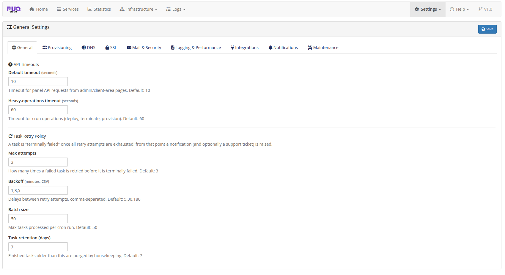
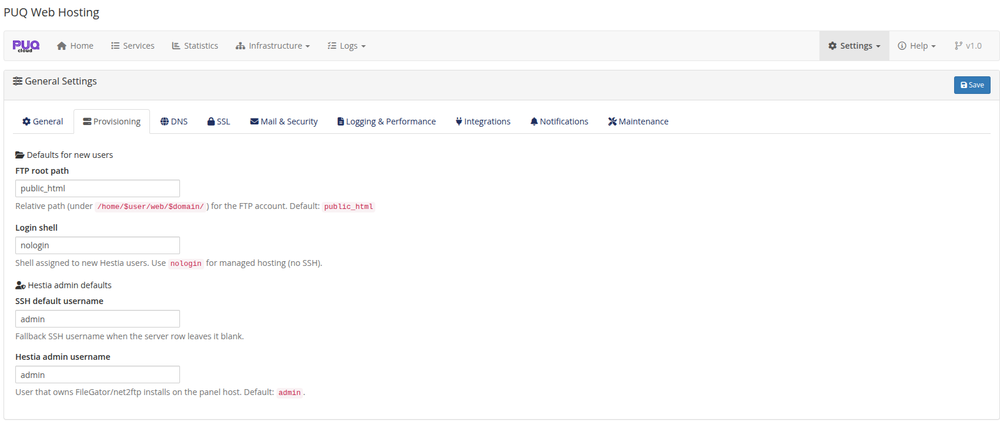
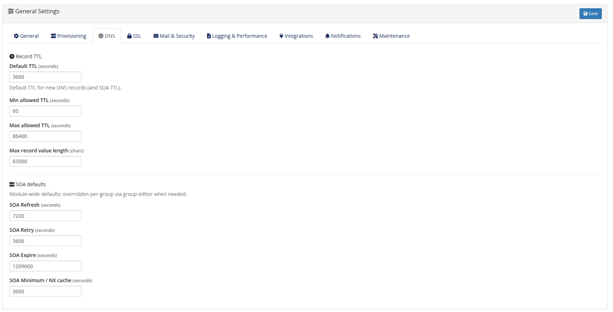
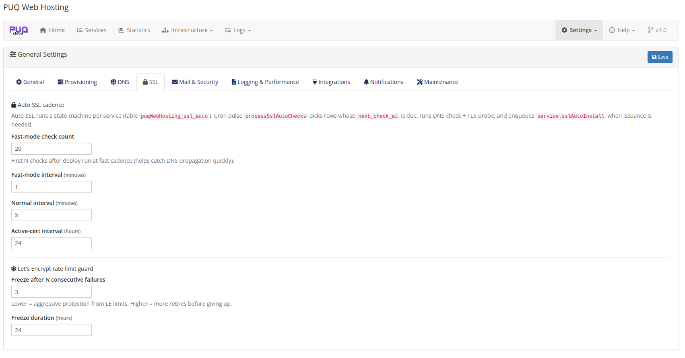
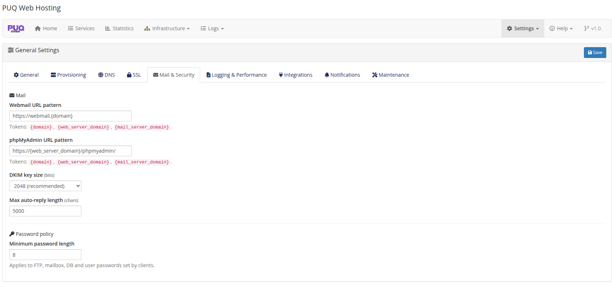
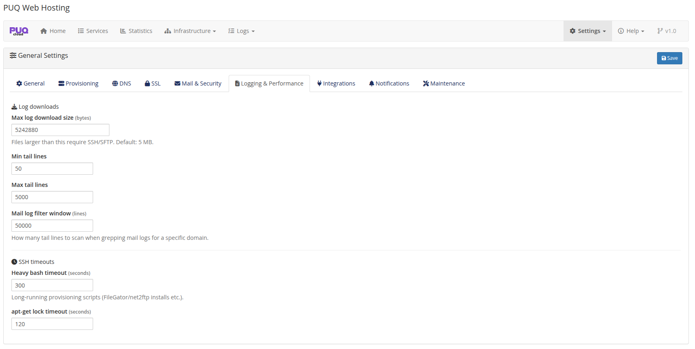
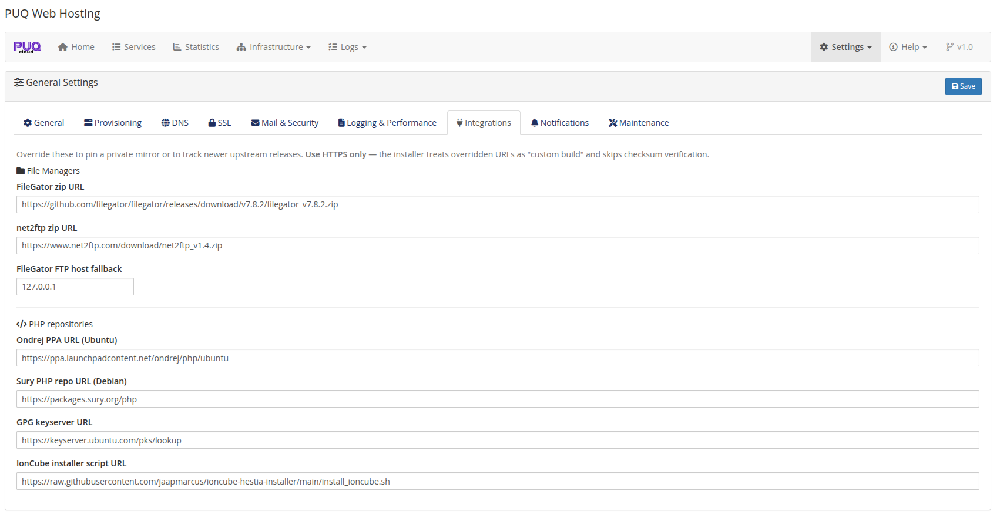
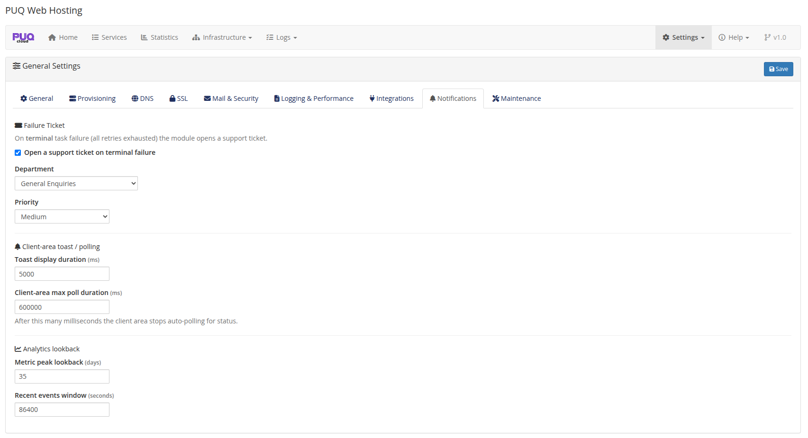
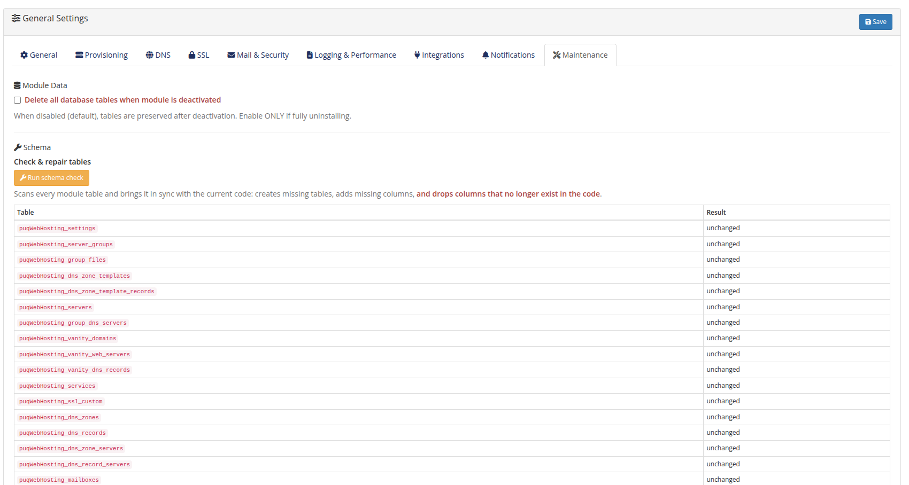
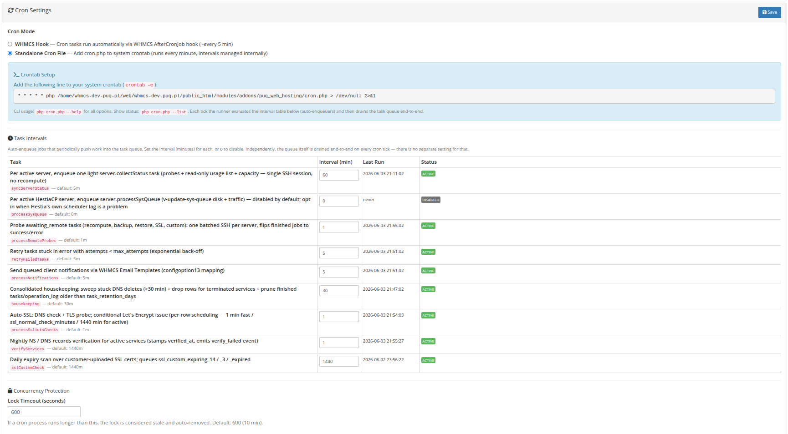

# Settings

### PUQ Web Hosting module **[WHMCS](https://puqcloud.com/link.php?id=77)**
#####  [Order now](https://puqcloud.com/whmcs-module-web-hosting.php) | [Download](https://download.puqcloud.com/WHMCS/servers/PUQ_WHMCS-WEB-Hosting/) | [Community](https://community.puqcloud.com/)

**Settings** has three pages — **General**, **Cron** and **Vanity widget**. The General page is organised into tabs. The defaults are sensible; tune them as you scale.

## General

The **General** tab itself holds API timeouts and the **task retry policy** (max attempts, back‑off minutes, batch size per cron run, finished‑task retention):

The remaining tabs:

| Tab | Controls |
|-----|----------|
| **Provisioning** | Defaults for new users — FTP root path, login shell (`nologin` for managed hosting), Hestia admin/SSH usernames.  |
| **DNS** | Record TTL (default/min/max, max value length) and module‑wide **SOA defaults**.  |
| **SSL** | Auto‑SSL cadence (fast‑mode count/interval, normal interval, active‑cert interval) and the Let's Encrypt **rate‑limit guard**.  |
| **Mail & Security** | Webmail / phpMyAdmin URL patterns, DKIM key size, max auto‑reply length, minimum password length.  |
| **Logging & Performance** | Log download size cap, tail line limits, mail‑log filter window, SSH heavy‑bash & apt‑lock timeouts.  |
| **Integrations** | Overridable upstream URLs — FileGator/net2ftp zips, FTP host fallback, PHP repos (Ondrej PPA, Sury), GPG keyserver, IonCube installer.  |
| **Notifications** | Failure‑ticket toggle (department + priority), client‑area toast/poll durations, analytics lookback windows.  |
| **Maintenance** | The schema **Check & repair** tool + the deactivation data‑retention toggle.  |

## Cron

The **Cron** page picks the cron mode (WHMCS vs Standalone), shows the crontab line to install, and lists every scheduled task with its enable/interval/last‑run/status, plus concurrency limits.

## Vanity widget

Generates the standalone "claim your name" shop widget — see **Vanity Mode → The vanity shop widget**.
