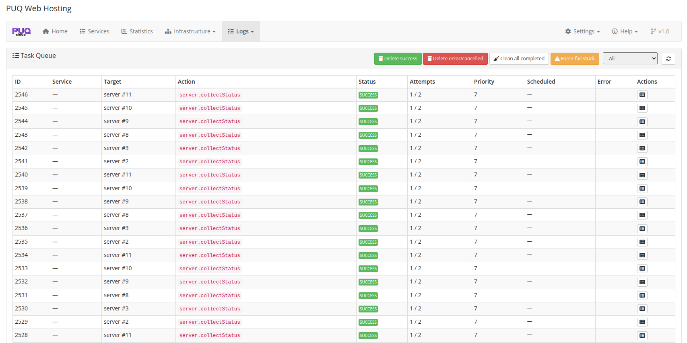
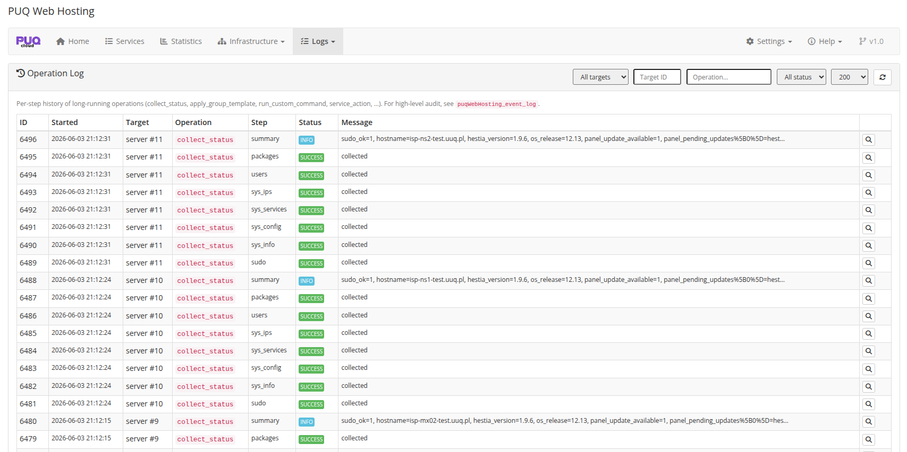
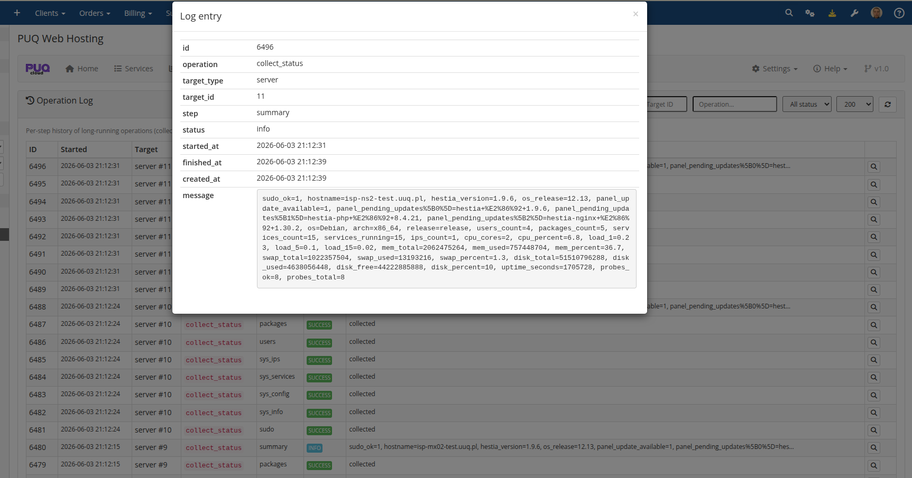

# Task Queue & Logs

### PUQ Web Hosting module **[WHMCS](https://puqcloud.com/)**
#####  [Order now](https://puqcloud.com/) | [Download](https://download.puqcloud.com/WHMCS/servers/PUQ_WHMCS-WEB-Hosting/) | [FAQ](https://faq.puqcloud.com/)

Everything the module does runs through a **task queue** processed by the cron runner. The **Logs** menu exposes both the live queue and a persistent operation history.

## Task Queue

Logs → **Task Queue** is the live worker view: each task's ID, service, target, action (e.g. `server.collectStatus`, `web.addFtp`), status, attempts, priority, schedule and error.

Bulk controls let you tidy up: **Delete success / error / cancelled**, **Clean all completed**, and **Force‑fail stuck** (for tasks wedged by an unreachable node).

## Operation Log

Logs → **Operation Log** is a persistent, per‑operation timeline (status collection, deploys, etc.) — useful for auditing what happened and when.

Click a row to open the full detail — the operation, target, step, status and the complete message body:

> The retry policy (how many times and how fast failed tasks retry) and the optional **support ticket** on terminal failure are configured in **Settings → General / Notifications**, and explained in **Cron & Automation → Task queue, retries & tickets**.
