# Service Management

### PUQ Web Hosting module **[WHMCS](https://puqcloud.com/link.php?id=77)**
#####  [Order now](https://puqcloud.com/whmcs-module-web-hosting.php) | [Download](https://download.puqcloud.com/WHMCS/servers/PUQ_WHMCS-WEB-Hosting/) | [Community](https://community.puqcloud.com/)

Every hosting service is managed from inside its WHMCS service page. At the top you get the standard WHMCS editor with the Configurable‑Option dropdowns and the **Module Commands** (Create / Suspend / Unsuspend / Terminate / Change Package):

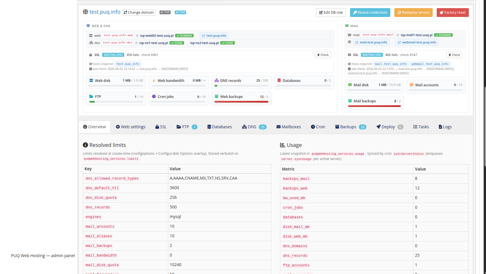

Below that, the module embeds a full **admin service panel** — your staff's day‑to‑day console for the service.

## Overview

The Overview shows two role cards. **Web & DNS** lists the web Hestia user, the DNS user and zones (with deploy badges) and the website usage gauges; **Mail** lists the mail user, mail/webmail links and the mailbox gauges. Both show the SSL state. Top buttons: **Edit DB row · Reveal credentials · Redeploy service · Factory reset · Change domain**.

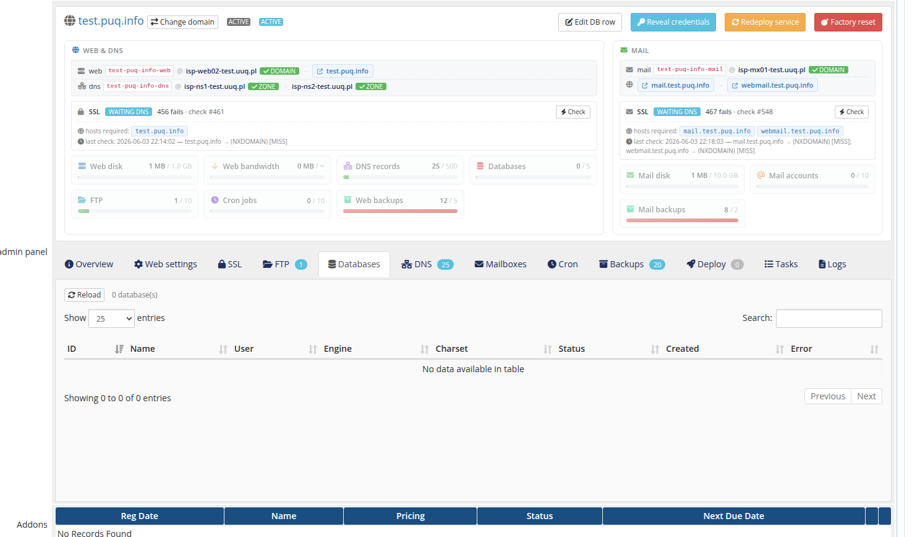

## Per‑resource tabs

The tab bar mirrors the client area but read/write for staff:

| Tab | What you do |
|-----|-------------|
| **Web settings** | PHP version, HTTPS redirect, proxy extensions. 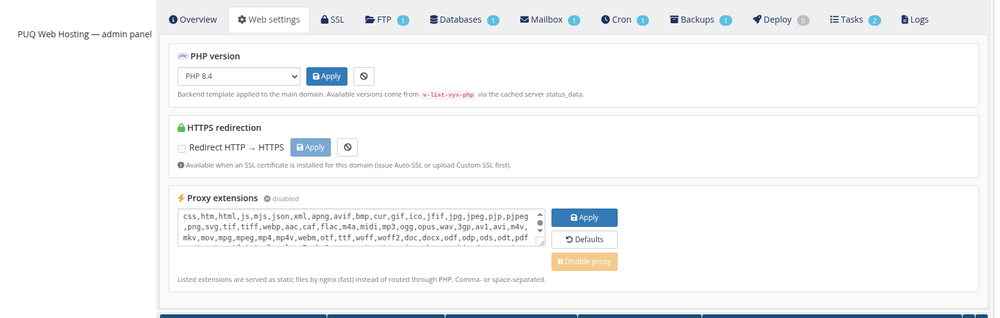 |
| **SSL** | Auto‑SSL state per role + custom‑cert upload; Issue/Renew now. 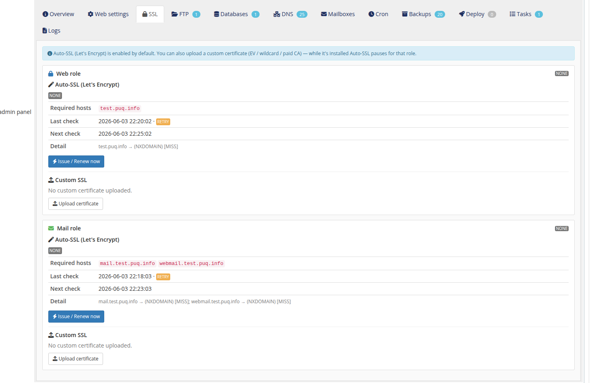 |
| **FTP** | FTP accounts (full prefixed username). 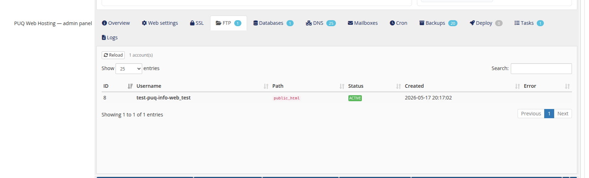 |
| **Databases** | Databases (name/user, engine, charset, size). 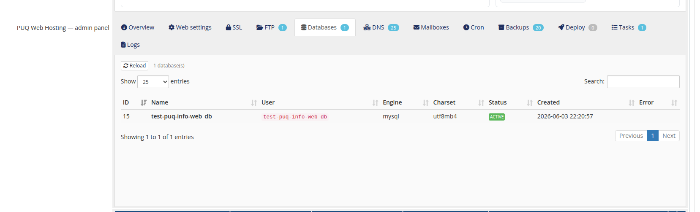 |
| **DNS** | The service's zone records (type/name/value/pri/TTL) with per‑server deploy state. 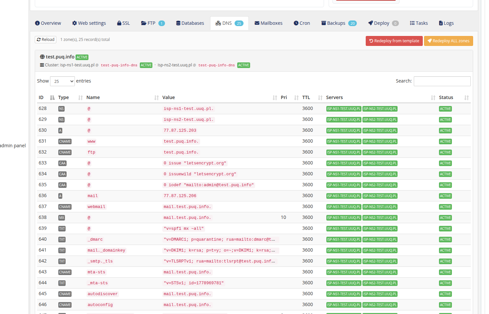 |
| **Mailboxes** | The service's mailboxes (email, quota, status). 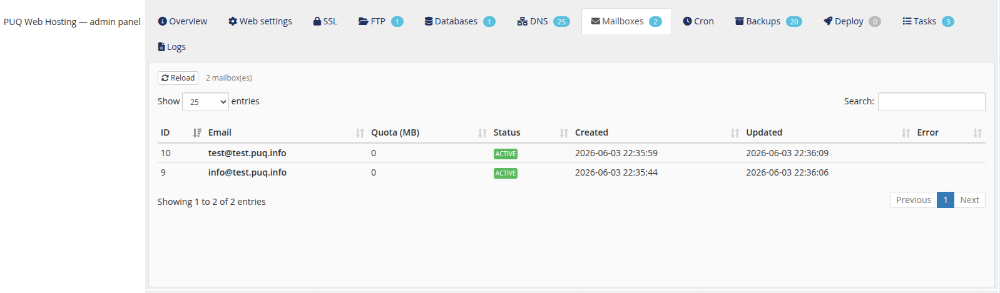 |
| **Cron** | Cron jobs (schedule, command, status). 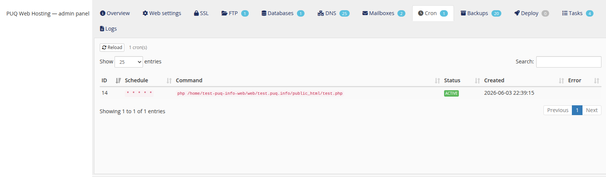 |
| **Backups** | Web + Mail backup lists with Backup now / Sync from server / Restore / Delete / Check restore. 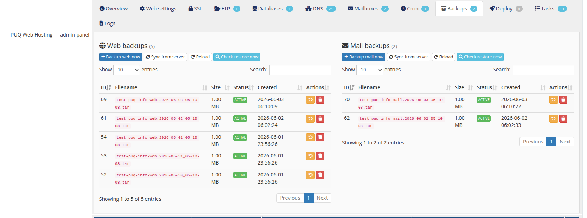 |
| **Logs** | Real Hestia log tail (Apache/Exim/Dovecot), grep‑filtered to the domain. 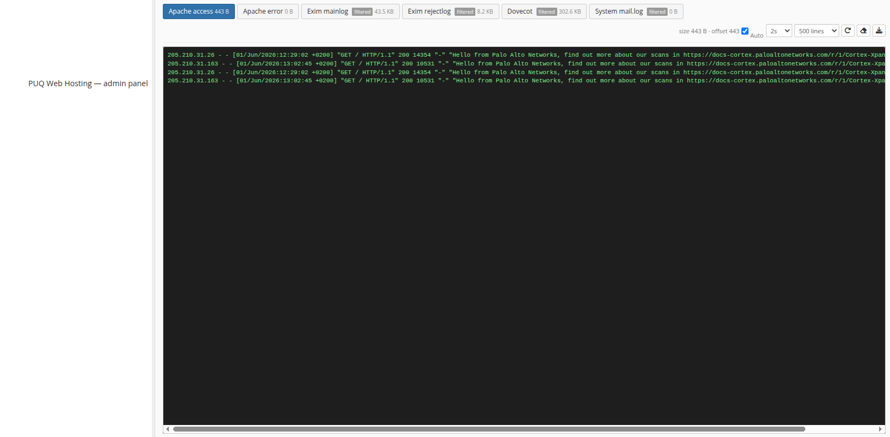 |

## Deploy & Tasks

The **Deploy** tab shows live deploy status, a full event timeline and **Redeploy (hard reset)**. The **Tasks** tab lists this service's tasks (action, target, server, status, attempts, timestamps); each opens a detail modal with the streamed SSH log.

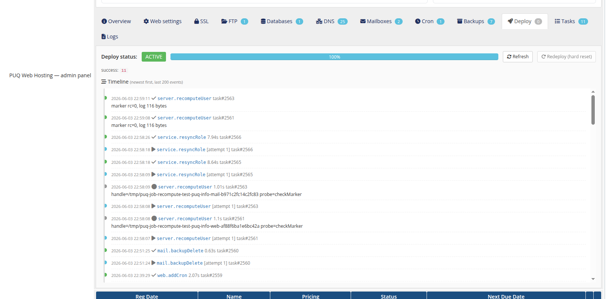
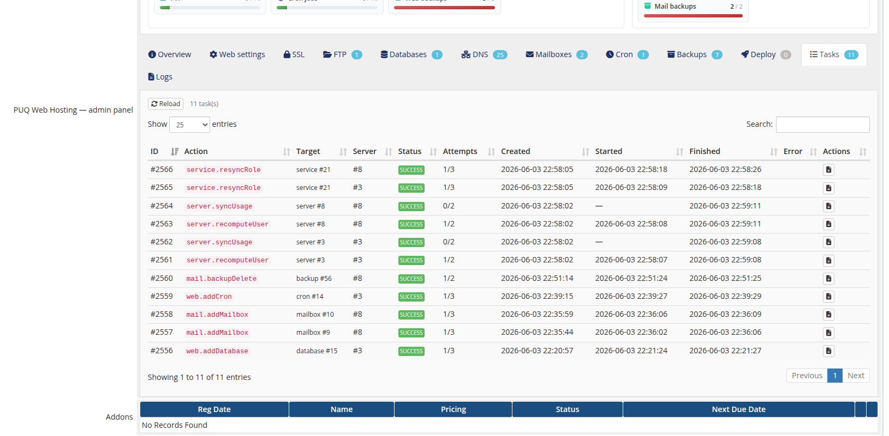
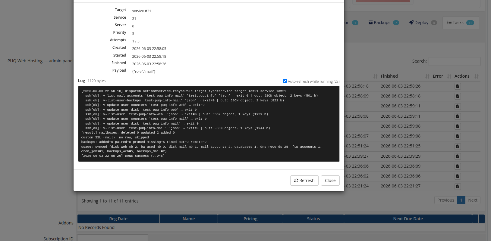

## Limits, usage & power tools

The Overview tab also carries the **Resolved limits** and live **Usage** tables, with **Force usage sync** and a **Verify & Repair** panel:

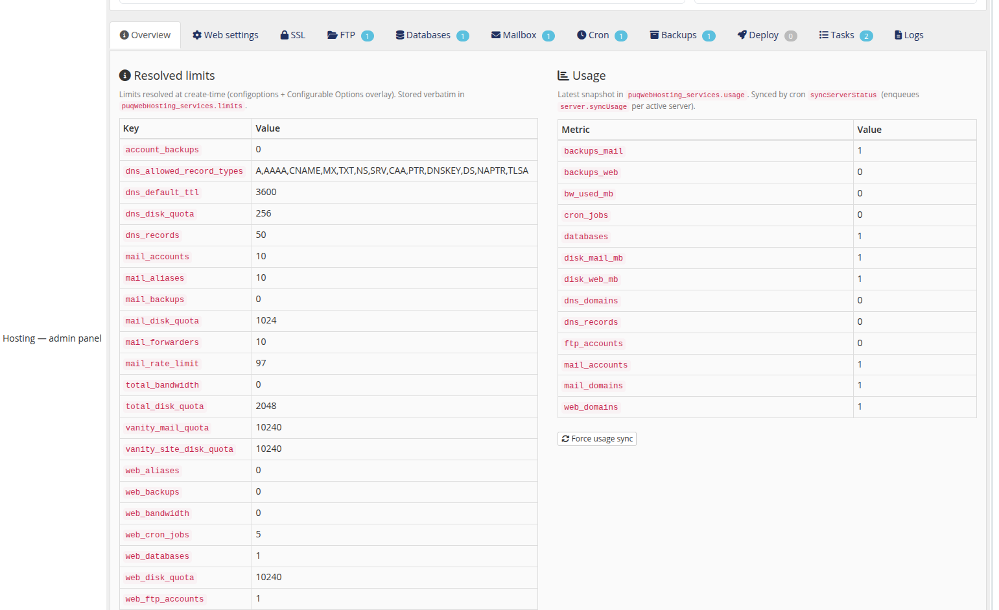

* **Reveal credentials** — decrypted logins/passwords for the web (FTP/panel/unix), mail and DNS Hestia users.

  
* **Edit DB row** — a raw editor of the service record for fixing rows that got into a bad state (bypasses provisioner validation — power users only).

  
* **Factory reset** — wipes the Hestia users + local child rows and re‑runs the full deploy chain (two‑step confirm).

## Cross‑service list

The addon **Services** page is the fleet‑wide view — search/filter by deploy or DNS state, see each service's **Mode** (Split/Vanity) and DNS ownership, open the admin panel, redeploy, unlock or force‑delete, and run **Verify** (probe panels + DNS and repair).

