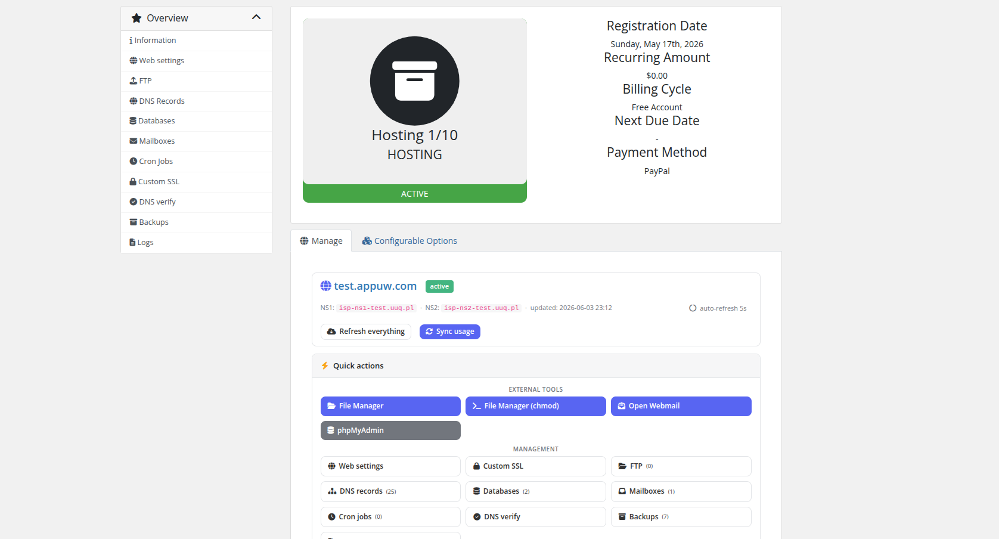
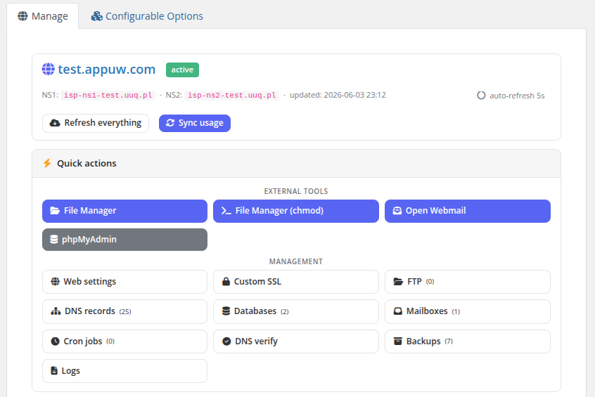
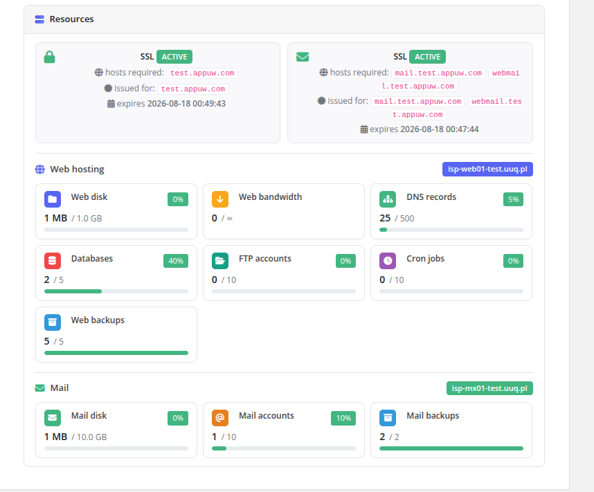
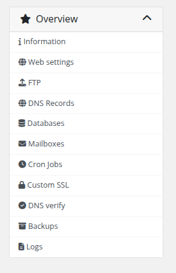

# Client Dashboard

### PUQ Web Hosting module **[WHMCS](https://puqcloud.com/link.php?id=77)**
#####  [Order now](https://puqcloud.com/whmcs-module-web-hosting.php) | [Download](https://download.puqcloud.com/WHMCS/servers/PUQ_WHMCS-WEB-Hosting/) | [Community](https://community.puqcloud.com/)

When a customer opens an active hosting service they land on a two‑column **Web | Mail** dashboard that summarises everything at a glance.

## Layout

* **Web card** — website URL, web server, PHP version, SSL state, and live usage bars (disk, bandwidth, databases, FTP accounts…).
* **Mail card** — webmail link, mail server, SSL state, and mailbox/quota usage bars.
* **Quick actions** — one‑click shortcuts to the panel, webmail, and the most‑used resource pages.

The usage bars are read from the local database (kept fresh by the usage‑sync cron); **Sync now** enqueues an on‑demand recompute if the customer wants the latest numbers immediately.

## Navigation

A sidebar lists every enabled feature — Web settings, FTP, Databases, DNS, Mailboxes, SSL, Backups, Cron, Logs. Which entries appear depends on the **product's Client permissions** (a Mail‑only product hides web pages, a Vanity product shows the simplified Website/Email set, etc.).

> During deployment the customer sees a live progress splash instead of the dashboard; on failure, an error screen with a **Try again** button (if the product allows redeploy). See **Deployment & Segmentation → How deployment works**.
