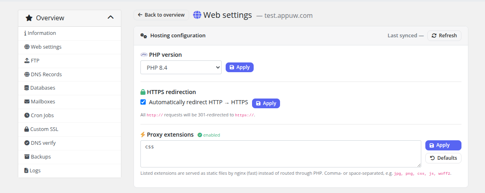

# Web Settings

### PUQ Web Hosting module **[WHMCS](https://puqcloud.com/link.php?id=77)**
#####  [Order now](https://puqcloud.com/whmcs-module-web-hosting.php) | [Download](https://download.puqcloud.com/WHMCS/servers/PUQ_WHMCS-WEB-Hosting/) | [Community](https://community.puqcloud.com/)

The **Web settings** page lets the customer self‑serve the three most common website tweaks without a ticket.

| Section | What it does |
|---------|--------------|
| **PHP version** | Pick any PHP version installed on the web server (e.g. 7.4 → 8.3). Applies the matching Hestia web template. |
| **HTTPS redirect** | Force `http → https`. Only selectable once SSL is active for the domain. |
| **Proxy extensions** | Choose which static file extensions the front proxy serves directly (with **Defaults** and **Disable** shortcuts). |

Each **Apply** is asynchronous: the request is queued, a spinner badge shows while the worker runs, and an error tooltip surfaces if Hestia rejects the change. The page mirrors the live state back from the server, so what you see is what's actually applied.

> These controls appear only if the product's Client permissions enable hosting settings. On a Vanity service this page is simplified to the relevant subset.
