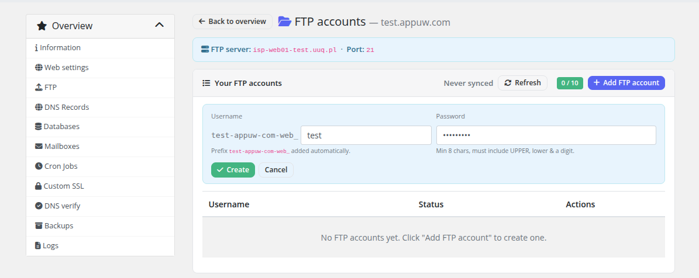
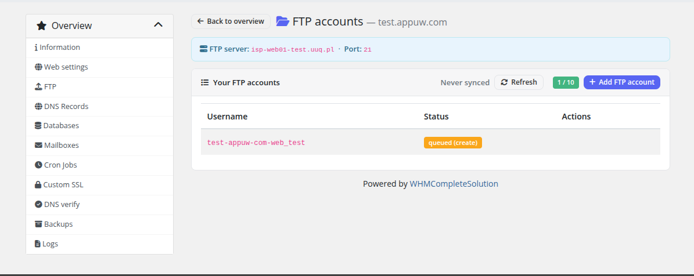
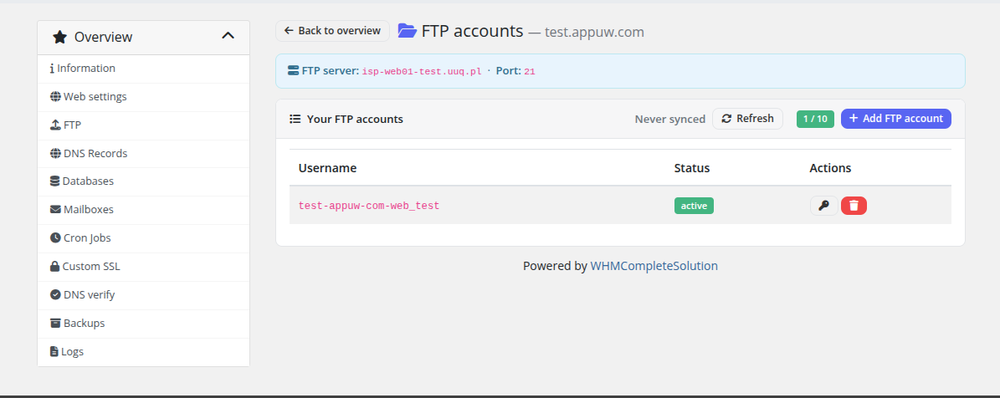

# FTP Accounts

### PUQ Web Hosting module **[WHMCS](https://puqcloud.com/link.php?id=77)**
#####  [Order now](https://puqcloud.com/whmcs-module-web-hosting.php) | [Download](https://download.puqcloud.com/WHMCS/servers/PUQ_WHMCS-WEB-Hosting/) | [Community](https://community.puqcloud.com/)

Customers manage their own FTP accounts here, up to the product's FTP‑account limit.

## Creating an account

Enter a suffix and a password (or generate one) and submit. The real Hestia username is the main web user plus your suffix (`<webuser>_<suffix>`) — the page shows the **full** username so the customer knows exactly what to type into their FTP client. The home directory and shell are set by the **Provisioning** defaults (typically `nologin`, so FTP/SFTP only).

The action is queued, so the new row appears with a **Queued** badge first:

…and flips to **Active** once the worker has created it on the server:

> The suffix length is budget‑aware: the module reserves enough characters so the combined username stays within Hestia's limit. If a suffix would overflow, it's rejected before submission.

Open the file manager (FileGator / net2ftp) from the dashboard quick actions for in‑browser file access without a desktop FTP client.
