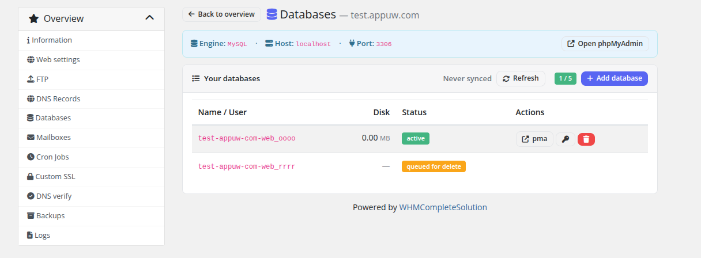

# Databases

### PUQ Web Hosting module **[WHMCS](https://puqcloud.com/link.php?id=77)**
#####  [Order now](https://puqcloud.com/whmcs-module-web-hosting.php) | [Download](https://download.puqcloud.com/WHMCS/servers/PUQ_WHMCS-WEB-Hosting/) | [Community](https://community.puqcloud.com/)

The **Databases** page lets customers create and manage MySQL/MariaDB databases up to the product's database limit.

Each database is created with its own dedicated user. As with FTP, the database and user names are prefixed with the main web user (`<webuser>_<suffix>`), and the page shows the **full** names plus the live size of each database.

* **Create** — pick a suffix and password; the database and matching user are provisioned together (queued → active).
* **Delete** — removes the database and its user.
* **phpMyAdmin** — opens the configured phpMyAdmin URL for in‑browser administration.

> Database size is read by the usage‑sync cron and counts toward nothing by itself, but the **number** of databases is capped by the product limit / Configurable Option.
