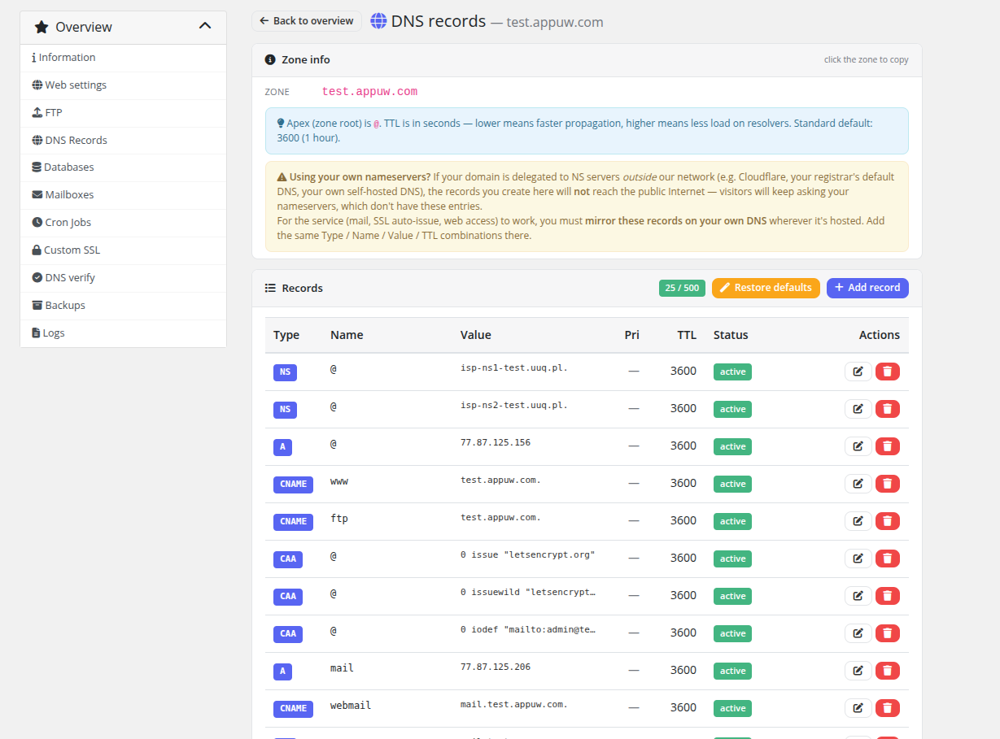
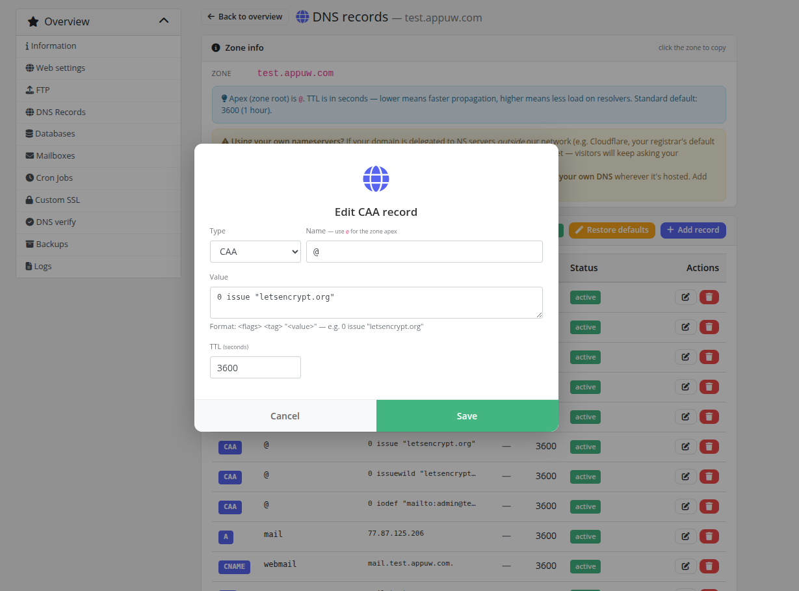
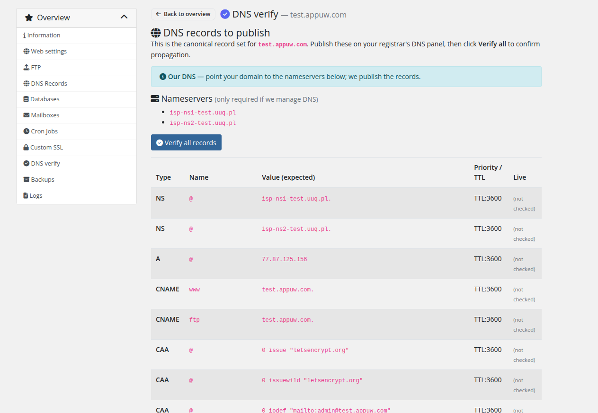

# DNS Records

### PUQ Web Hosting module **[WHMCS](https://puqcloud.com/)**
#####  [Order now](https://puqcloud.com/) | [Download](https://download.puqcloud.com/WHMCS/servers/PUQ_WHMCS-WEB-Hosting/) | [FAQ](https://faq.puqcloud.com/)

If the product includes the DNS role, customers manage their zone's records here, up to the product's record limit.

## Editing records

Add, edit or delete A / AAAA / CNAME / MX / TXT / SRV records. The editor validates the type/value and shows the TTL within the configured min/max bounds.

Every change is fanned out to **all** DNS servers attached to the service's group (the active‑active cluster), so records stay identical on every nameserver. See **Deployment & Segmentation → Server segmentation** for how the DNS pool works.

## External DNS

If the service was set up with **external DNS** (the customer keeps DNS elsewhere), this page instead shows the records they need to publish at their own provider, plus a **Verify** check that probes the live nameservers and confirms the records resolve:

