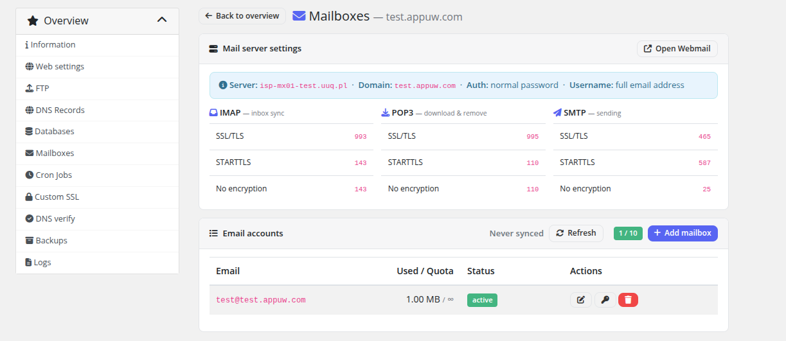
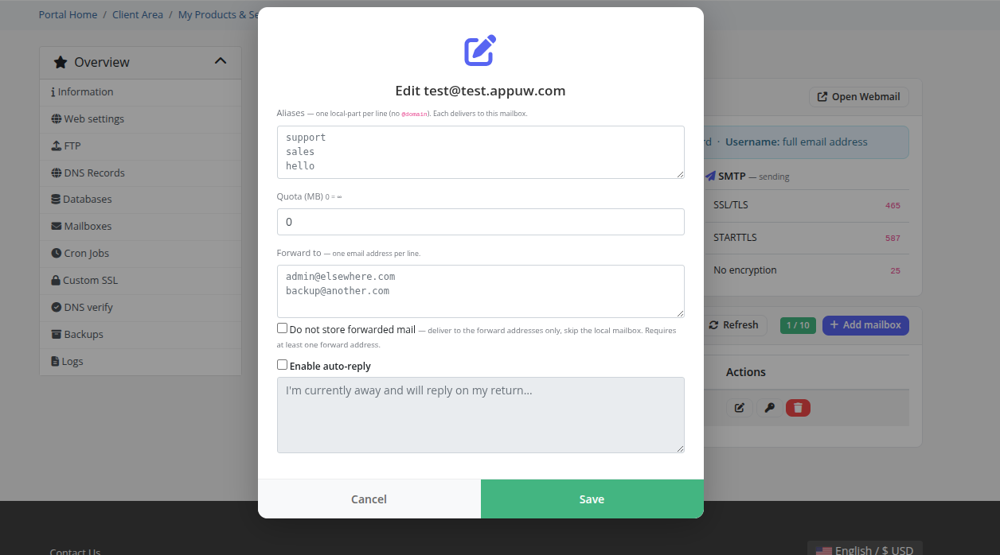

# Mailboxes

### PUQ Web Hosting module **[WHMCS](https://puqcloud.com/link.php?id=77)**
#####  [Order now](https://puqcloud.com/whmcs-module-web-hosting.php) | [Download](https://download.puqcloud.com/WHMCS/servers/PUQ_WHMCS-WEB-Hosting/) | [Community](https://community.puqcloud.com/)

On a service with the Mail role, customers manage their mailboxes here, up to the product's mailbox limit.

## Per‑mailbox settings

Create a mailbox with an address and password, then open it to manage:

* **Password** — reset the mailbox password.
* **Quota** — per‑mailbox storage limit (or unlimited), within the service's mail quota.
* **Forwards** — forward incoming mail to one or more addresses.
* **Auto‑reply** — vacation / out‑of‑office responder.

**Webmail** opens the configured webmail URL for the mail server.

> On a **Vanity** service this is the single `name@<your-domain>` mailbox, presented as a simplified Email page — see **Vanity Mode → Order & client experience**.
