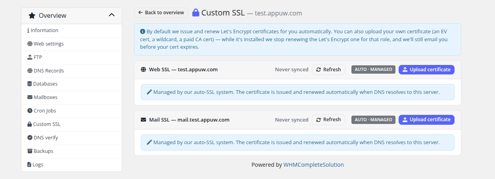
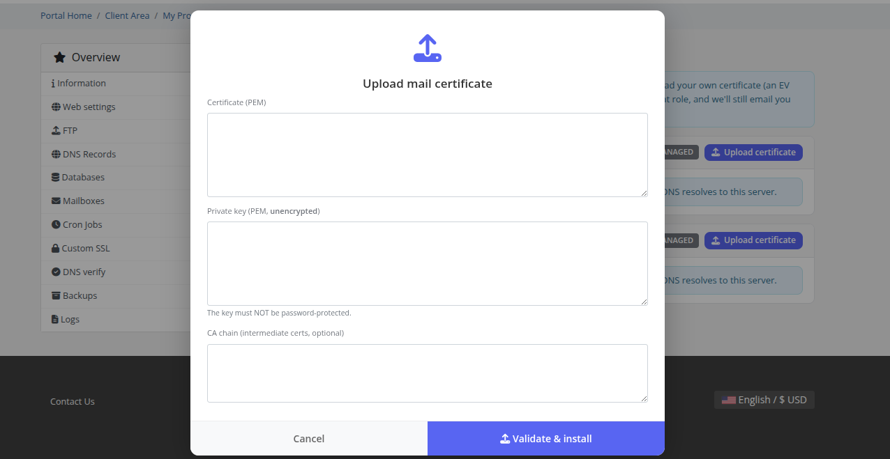

# SSL

### PUQ Web Hosting module **[WHMCS](https://puqcloud.com/link.php?id=77)**
#####  [Order now](https://puqcloud.com/whmcs-module-web-hosting.php) | [Download](https://download.puqcloud.com/WHMCS/servers/PUQ_WHMCS-WEB-Hosting/) | [Community](https://community.puqcloud.com/)

The **SSL** page shows certificate status and lets customers upload a custom certificate.

## Automatic SSL

In the common case there's nothing to do: the module issues and renews **Let's Encrypt** certificates automatically for the website (and for `mail.` / `webmail.` on the mail role). The page shows the current state and expiry; the cadence and rate‑limit guards are described in **Cron & Automation → SSL automation**.

## Custom certificate

Customers who already have a certificate (e.g. a wildcard or EV cert) can upload it here — certificate, private key and optional CA bundle:

Uploading a custom certificate installs it on the domain and **suspends auto‑SSL** for that role so it won't be overwritten. A daily cron checks custom‑cert expiry and notifies before it lapses.
