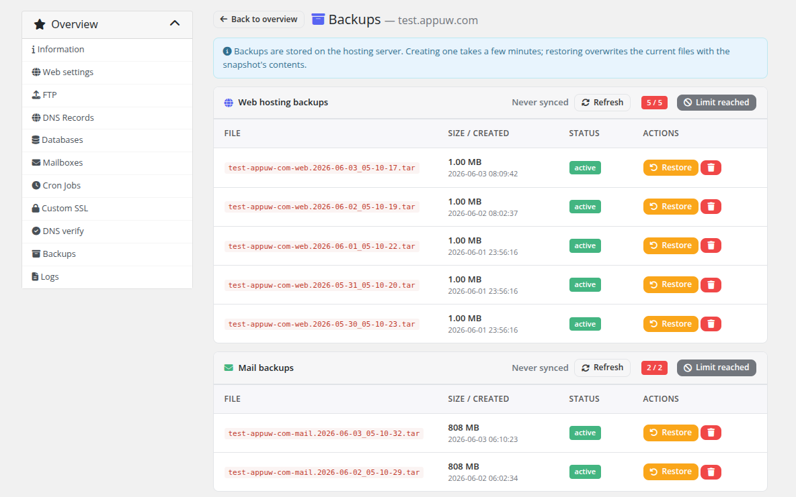
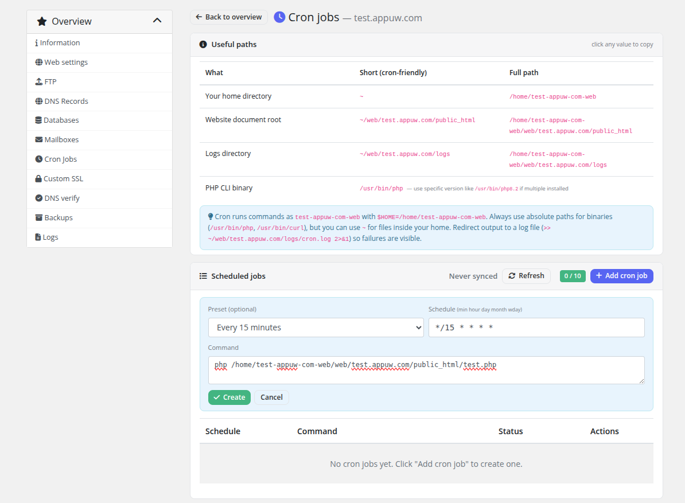
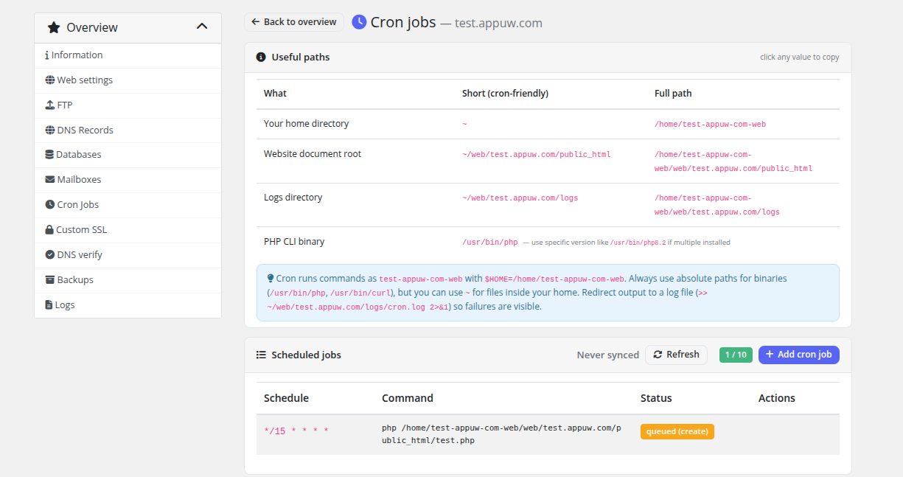
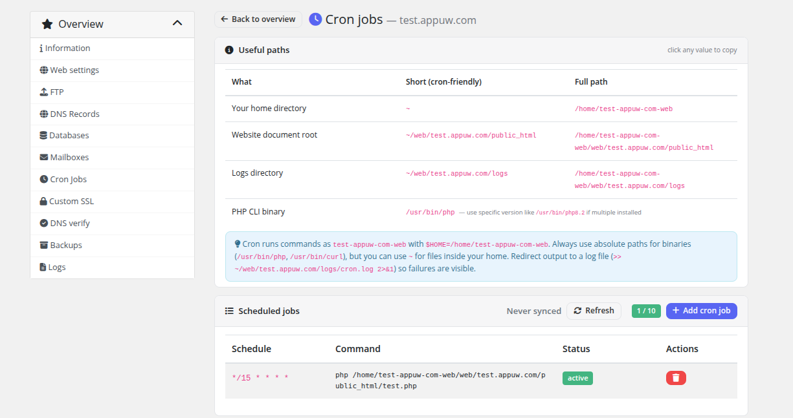
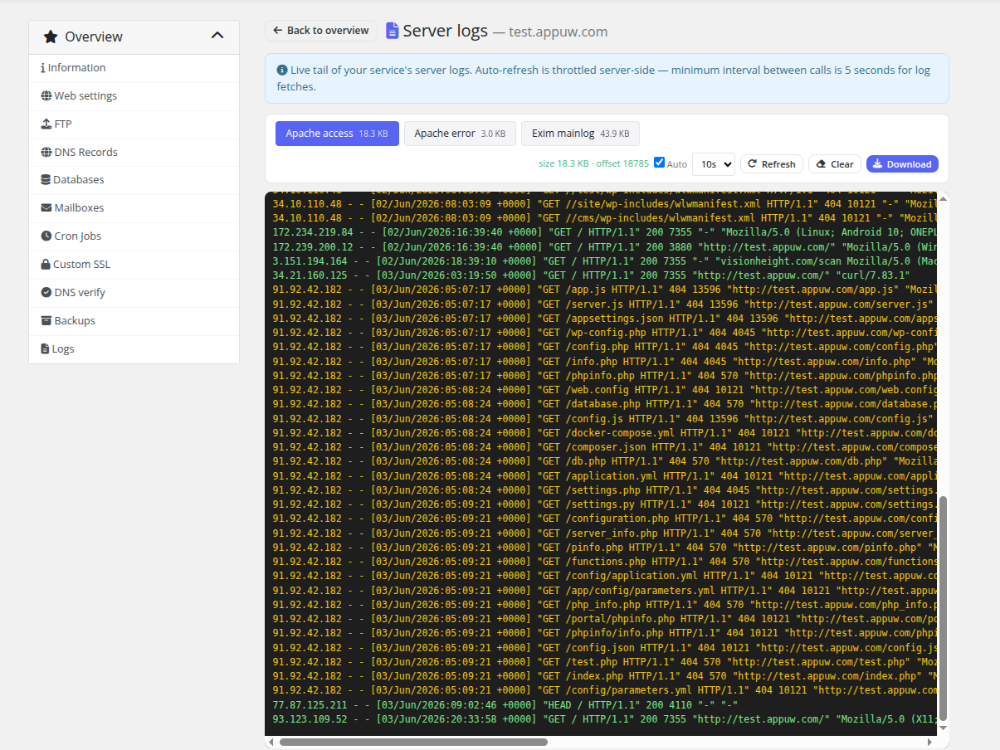

# Backups, Cron & Logs

### PUQ Web Hosting module **[WHMCS](https://puqcloud.com/link.php?id=77)**
#####  [Order now](https://puqcloud.com/whmcs-module-web-hosting.php) | [Download](https://download.puqcloud.com/WHMCS/servers/PUQ_WHMCS-WEB-Hosting/) | [Community](https://community.puqcloud.com/)

Three more self‑service pages round out the client area.

## Backups

Customers can take and restore their own snapshots, up to the product's web/mail backup quota.

* **Create** — schedules a snapshot on the server (asynchronous; the row shows a *creating* badge until the file appears).
* **Restore** — restores a snapshot; a typed **RESTORE** confirmation is required, and write actions on the service are locked while the restore runs.
* **Delete** — removes a snapshot.

Web and mail snapshots are listed and quota‑counted separately.

## Cron

Customers manage scheduled jobs for their website, up to the cron‑job limit.

Add a job with a schedule and command; it's queued (**Queued** badge) and goes **Active** once installed on the server:

## Logs

The **Logs** page tails the website's real server logs (Apache/Exim/Dovecot as applicable), grep‑filtered to the customer's own domain, with a size‑capped download.

> Every one of these pages is gated by the product's **Client permissions**, so you can expose exactly the feature set each plan should have.
