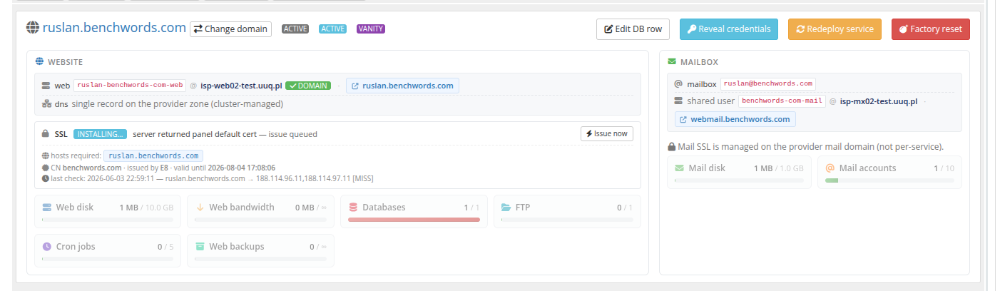

# Deployment Models (Split · Unified · Vanity)

### PUQ Web Hosting module **[WHMCS](https://puqcloud.com/link.php?id=77)**
#####  [Order now](https://puqcloud.com/whmcs-module-web-hosting.php) | [Download](https://download.puqcloud.com/WHMCS/servers/PUQ_WHMCS-WEB-Hosting/) | [FAQ](https://faq.puqcloud.com/)

Every product you sell has a **Deployment mode** set on the product's *Module Settings → General* tab. It decides **how many HestiaCP accounts** back each service and **where** the web, mail and DNS roles live. This is the single most important product decision.

## The three modes

| Mode | Hestia accounts per service | Best for |
|------|-----------------------------|----------|
| **Split** | A **separate Hestia user per role** — one web user, one mail user, one DNS user (each can live on a different server). | Classic shared/business hosting where you want maximum isolation and the freedom to put web, mail and DNS on different, independently‑scaled servers. |
| **Unified** | **One Hestia user** holds web **and** mail (and local DNS) for the service. | Simpler, denser, cheaper hosting where web and mail naturally live together on one node. |
| **Vanity** | A **per‑service web user** for one subdomain + **one mailbox** on your **shared provider** mail account. | Selling `name.yourdomain.com` websites and `name@yourdomain.com` mailboxes on a domain *you* own — see the dedicated **Vanity Mode** chapter. |

### Split deployment

In Split mode the module provisions up to three independent HestiaCP users for the service — for example `customer-com-web`, `customer-com-mail` and `customer-com-dns`. Each is placed on a server that has the matching capability, so the **website**, the **mailboxes** and the **DNS zone** can sit on completely different machines.

The admin service panel shows this clearly — a **Web & DNS** card and a separate **Mail** card, each with its own Hestia user, server and certificate:

Split is the mode to choose when you want to **segment your fleet by role** (the next page) and keep mailboxes off your web servers.

### Unified deployment

In Unified mode a single Hestia user owns the website and the mailboxes, so web and mail are always co‑located. There is no separate mail user to manage. Unified products use a single combined account package and a single set of backups (`role = all`). Choose Unified when you run general‑purpose nodes that do both jobs and you want fewer accounts to manage.

### Vanity deployment

Vanity is a different business model rather than a different server layout: you own a domain (e.g. `benchwords.com`) and sell **slots** on it. Each order becomes `name.benchwords.com` (a normal per‑service web account) plus `name@benchwords.com` (one mailbox on your **shared** provider mail user). The parent domain, its DNS zone and the provider mail account are **never** modified per order — the model is destructive‑safe by design.

Vanity has its own chapter because the setup (sellable parent domains, reserved names, the order flow and a drop‑anywhere shop widget) is substantial — see **Vanity Mode**.

## Which roles does a product include?

Independently of the mode, the product's *General* tab lets you tick which **roles** the package includes — **Web**, **Mail**, **DNS**. Unticking a role (or setting its disk quota to `0` in the limits tab) simply omits it. For example, a "mail‑only" product ticks Mail and leaves Web off; a "website‑only" product ticks Web and DNS.

The limits for each ticked role are configured on the matching *Web limits* / *Mail limits* / *DNS limits* tab (or the single *Vanity limits* tab in Vanity mode) — see **Installation & Configuration → Create a product**.

> **Rule of thumb:** Split = isolation + segmentation; Unified = density + simplicity; Vanity = a productised "personal site + email" offer on your own domain. You can sell all three side‑by‑side — they coexist on the same servers.
