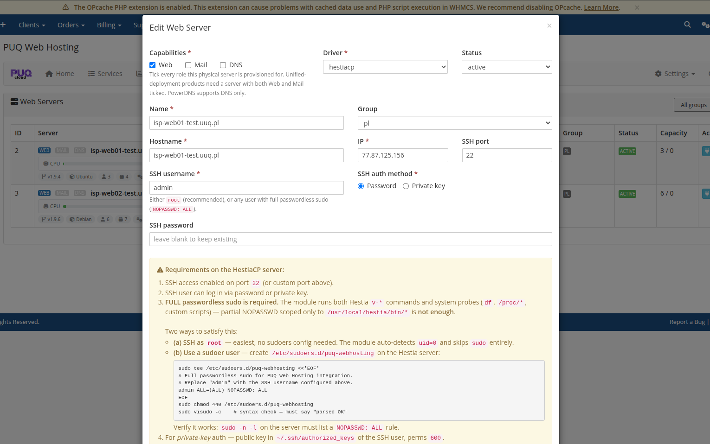
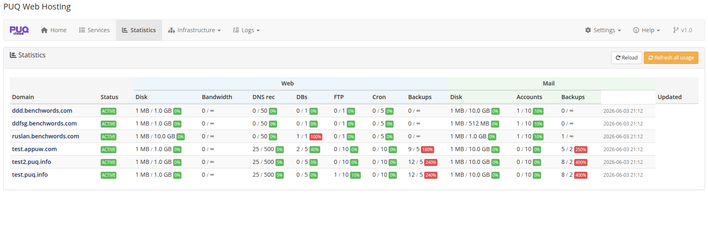

# Server Segmentation (Web / Mail / DNS tiers)

### PUQ Web Hosting module **[WHMCS](https://puqcloud.com/)**
#####  [Order now](https://puqcloud.com/) | [Download](https://download.puqcloud.com/WHMCS/servers/PUQ_WHMCS-WEB-Hosting/) | [FAQ](https://faq.puqcloud.com/)

## One server or many?

You can run the whole module on a **single** HestiaCP node that does everything. That is perfect for getting started, for small offers, and for testing.

But the module is designed so you can **segment** your fleet as you grow: put **websites** on one set of servers, **mailboxes** on dedicated **mail (MX)** servers, and **DNS** on separate **nameservers**. Each role then scales on its own hardware, and a busy mail queue or a heavy website can't starve the others.

The mechanism that makes this possible is **server capabilities** + **server groups**.

## Capabilities — what a node is allowed to host

Each server you add (Infrastructure → *Web / Mail / DNS Servers*) has three capability flags: **Web**, **Mail**, **DNS**. You tick them when you add or edit the node. A node can carry one role, two, or all three.

This is how you decide your topology. Typical patterns:

| Pattern | Web nodes | Mail nodes | DNS nodes |
|---------|-----------|-----------|-----------|
| **All‑in‑one** | one node ticks Web + Mail + DNS | (same node) | (same node) |
| **Web / mail split** | nodes tick **Web** only | dedicated **Mail** nodes (your MX) | nodes tick **DNS** only |
| **Full three‑tier** | Web pool | Mail pool | Nameserver pool (e.g. `ns1`, `ns2`) |

In the Infrastructure pages the same physical servers appear under **Web Servers**, **Mail Servers** and **DNS Servers** filtered by their capability — so a mail‑only node only shows up under Mail:

When a **Split** service is provisioned, the module places each role on a **least‑loaded active node that has the matching capability**: the web user lands on a Web node, the mailbox on a Mail node, the DNS zone on the group's DNS nodes. That is the load balancing — it is **by role and by capacity**, automatically.

## Server groups — the unit you sell from

A **server group** ties a set of nodes together and is what a product points at (the product's *Server Group* dropdown). Open a group to manage it.

The group's **Actions** tab shows the members with their **Type** (WEB / MAIL) and lets you push configuration to **all servers**, **web servers only**, **mail servers only** or **DNS servers only**. That last point is the key to safe segmentation: a web‑specific setting is **never** applied to a mail node and vice‑versa.

### Role‑targeted configuration

The group editor has separate config tabs whose values are pushed **only** to nodes of that role during *Apply Hestia config*:

* **All‑servers config** — keys applied to every node (language, theme, security/API, user policies…).
* **Web config** — web‑only keys (Apache/Nginx ports, web backend, phpMyAdmin alias…).

  
* **Mail config** — mail‑only keys (SMTP/IMAP system, antispam/antivirus, webmail, notification from‑address…).

  
* **DNS config** — DNS‑only keys (DNSSEC, DNS cluster). PowerDNS nodes have no `hestia.conf` and are skipped automatically.

The worker filters every managed key by its category target, so "mail‑only keys never land on web servers and vice‑versa". This means you can, for instance, enable ClamAV/SpamAssassin only on your mail tier without touching the web tier.

## DNS is active‑active across the tier

DNS servers are **independent** — you attach them to a group on the group's **DNS servers** tab, and **one DNS server can serve many groups**. When a zone is created it is **replicated to every attached DNS node**, so you get an active‑active nameserver cluster out of the box. The **DNS Zones** page shows the per‑server deploy state for each logical zone:

## Watching the balance

The addon **Statistics** page reports usage **per domain, split into Web and Mail columns**, so you can see at a glance how load is distributed and when a tier needs another node:

The Home dashboard's **Server capacity** table lists each node by type with its capacity and last sync time — a quick health view of every tier.

> **Why segment?** Mail and web have very different load profiles. Keeping them on separate, capability‑tagged tiers lets you scale each independently, isolate failures, and apply role‑specific tuning — while the module's per‑capability placement spreads new accounts across the least‑loaded node automatically.
