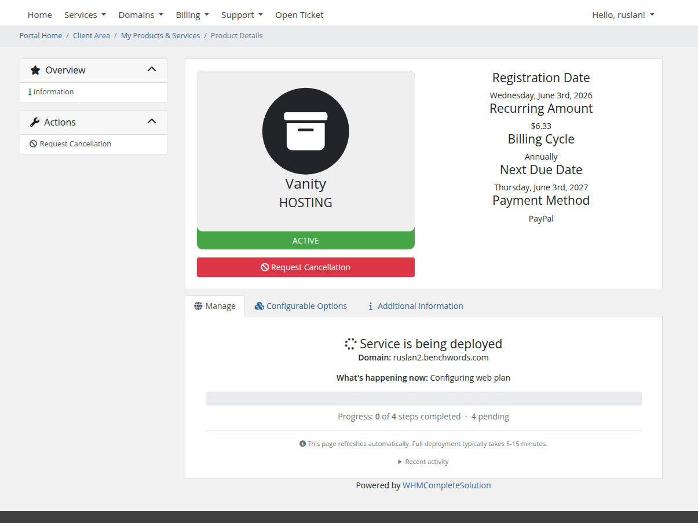
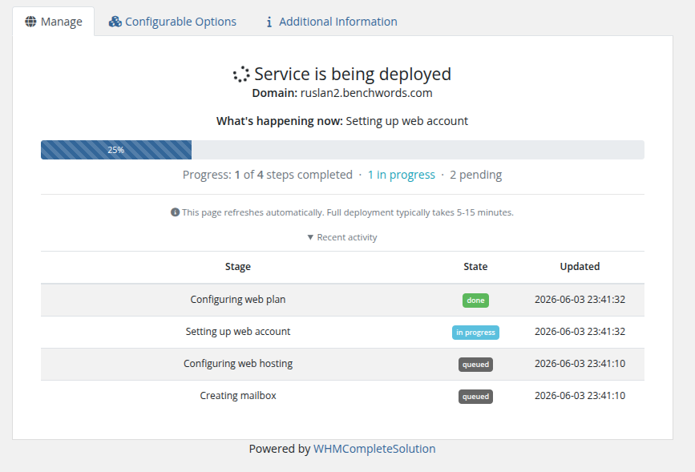
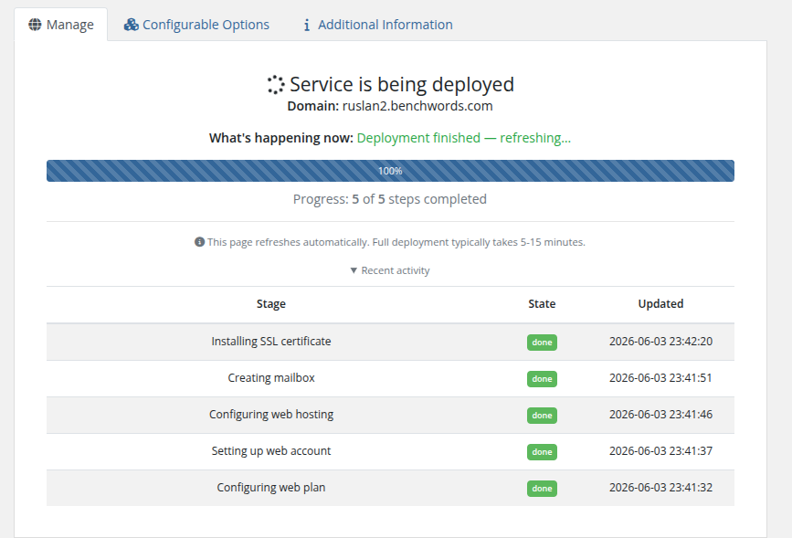
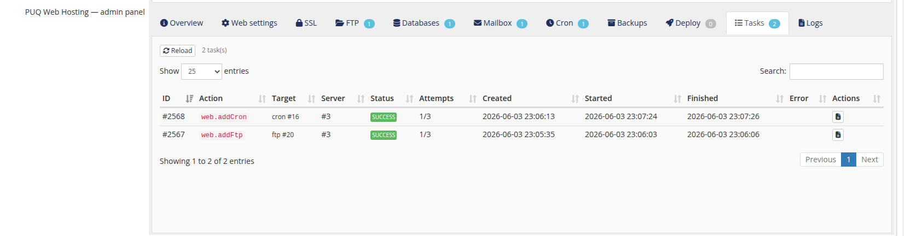

# How Deployment Works

### PUQ Web Hosting module **[WHMCS](https://puqcloud.com/link.php?id=77)**
#####  [Order now](https://puqcloud.com/whmcs-module-web-hosting.php) | [Download](https://download.puqcloud.com/WHMCS/servers/PUQ_WHMCS-WEB-Hosting/) | [FAQ](https://faq.puqcloud.com/)

## Orders return instantly — work happens in the background

When a service is created (a WHMCS order goes active, an admin clicks **Create**, or the API is called) the module does **not** try to build everything inside the HTTP request. It writes a service record, returns `success` to WHMCS immediately, and lets the **cron‑driven task queue** do the real work.

This is what the customer sees right after ordering — a live deployment splash that polls for progress and refreshes itself:

Each step is a queued **task** processed by the cron runner. As steps complete, the bar advances and the recent‑activity feed updates:

When the last step finishes the page flips to the live control panel:

This design makes provisioning resilient to slow panels, SSH timeouts, apt‑get locks and long operations — none of them block the order, and any failed step is simply retried.

## The pipeline (Split example)

A Split service is built by a chain of idempotent tasks, roughly in this order:

1. **Create the web package + web user** on a Web node.
2. **Add the web domain** (and the web account's quota/PHP settings).
3. **Create the mail user + mail domain** on a Mail node (with DKIM).
4. **Create the DNS user + zone** and **deploy the zone** to every attached DNS node.
5. **Seed Auto‑SSL** so Let's Encrypt issues as soon as DNS resolves.

Unified runs the same idea with one combined account; Vanity runs a trimmed chain (one web account, one mailbox on the shared mail user, one DNS record). Every task is **idempotent** — re‑running it is safe — so the chain can resume from wherever it stopped.

## Watching and driving it from the admin panel

The admin service panel's **Deploy** tab shows the live deploy status and a full **timeline** of every task with its duration and result, plus a **Redeploy (hard reset)** button:

The **Tasks** tab lists this service's tasks (action, server, attempts, timestamps); each row opens a detail modal with the streamed SSH log:

## Retries, failures and tickets

A failed task is retried with exponential back‑off. Once all attempts are exhausted it is **terminally failed**, the service shows a deploy error, and — if you enabled it — the module can open a **support ticket** for your staff. The retry policy and the failure‑ticket behaviour are configured in addon **Settings** (see *Cron & Automation → Task queue, retries & tickets*).

> **Key takeaway:** deployment is an asynchronous, idempotent, resumable pipeline. The order is accepted instantly, the queue does the work, failures self‑heal on retry, and both you and the customer get live progress.
