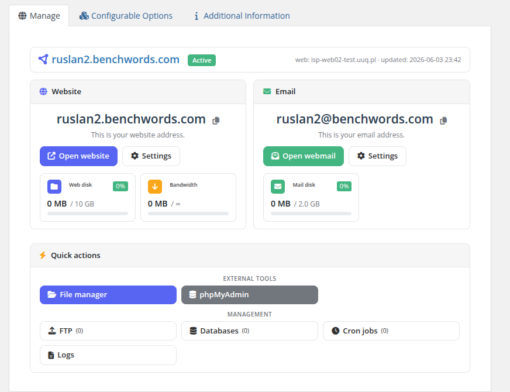

# What Vanity Mode Is (and Why It Sells)

### PUQ Web Hosting module **[WHMCS](https://puqcloud.com/link.php?id=77)**
#####  [Order now](https://puqcloud.com/whmcs-module-web-hosting.php) | [Download](https://download.puqcloud.com/WHMCS/servers/PUQ_WHMCS-WEB-Hosting/) | [FAQ](https://faq.puqcloud.com/)

## The idea in one sentence

You own a memorable domain — say `benchwords.com` — and you **rent out names on it**. A customer who picks `ruslan` gets:

* a **website** at `ruslan.benchwords.com`, and
* an **email address** `ruslan@benchwords.com`,

…provisioned in seconds, billed by WHMCS, and fully self‑service. One domain you already own becomes an unlimited catalogue of "personal site + email" products.

## Why customers buy it

Registering a domain, configuring DNS, setting up mail and getting a website online is intimidating for most people. Vanity removes all of that: pick a name on a brand they already like, and they have a real site and a real inbox. It is the simplest possible hosting product to *buy* — which makes it the easiest to *sell*.

This is exactly what the customer ends up with — a clean two‑card dashboard, **Website** and **Email**, with nothing else to configure:

## How it differs from normal hosting

A normal (Split/Unified) service gives the customer a **whole domain** and the full toolbox — DNS records, multiple mailboxes, SSL, backups, subdomains. A **vanity slot** is deliberately minimal:

| | Normal hosting | Vanity slot |
|---|---|---|
| Domain | the customer's own domain | one **name** on **your** domain |
| Website | full account | a per‑service web account for `name.yourdomain.com` |
| Mailbox | create/delete many | exactly **one** fixed mailbox `name@yourdomain.com` |
| DNS | full zone editor | nothing to manage — one record on **your** zone |
| SSL / Backups / Subdomains | customer‑managed | handled for them (mail SSL lives on your provider domain) |

The customer never sees DNS, SSL, backups or zone editing — those don't apply to a slot. The trimmed client menu reflects that.

## The safety guarantee (read this)

Vanity mode is **destructive‑safe by design**. No matter what a customer does — order, change password, set forwards, cancel — the module only ever touches:

* the **per‑service web user** for that one subdomain,
* **one mailbox** on your shared provider mail user, and
* **one DNS record** (in push mode) for the subdomain.

It **never** touches the **parent mail domain**, the **DNS zone**, or your **provider Hestia user**. One customer's actions can never affect another customer or your base domain. You will see this guarantee restated on the setup screen — it is a load‑bearing invariant of the whole model.

## Two ways to sell it

1. **Inside WHMCS** — a normal product with a live name‑availability check on the order form (covered in *The vanity product* and *Order & client experience*).
2. **Anywhere** — a standalone **shop widget** (two small files) you drop on any marketing domain. It shows a "claim your name" landing page and sends buyers straight into your prefilled WHMCS cart (covered in *The vanity shop widget*).

> The next pages set it up end‑to‑end: first the **server group + sellable domains**, then the **product**, then the **order/client experience**, then the **widget**.
