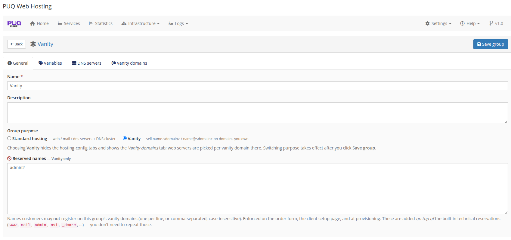
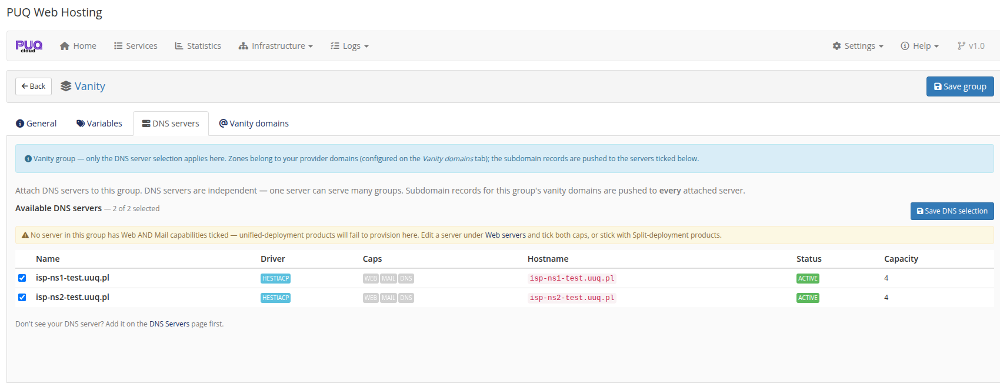
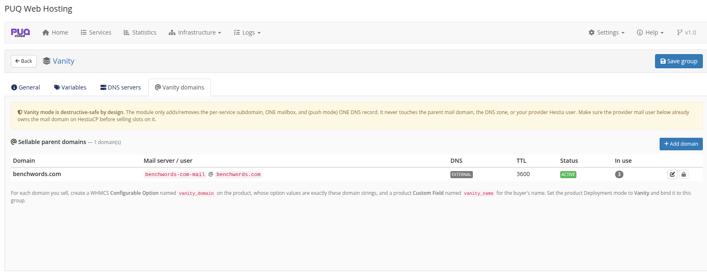
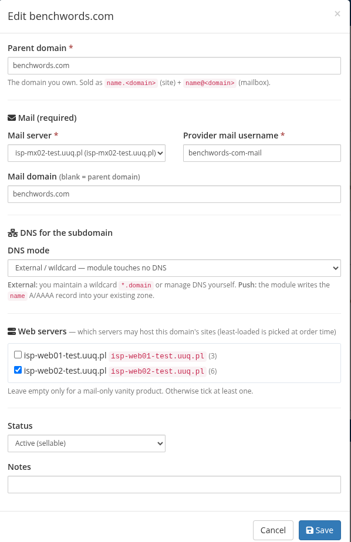
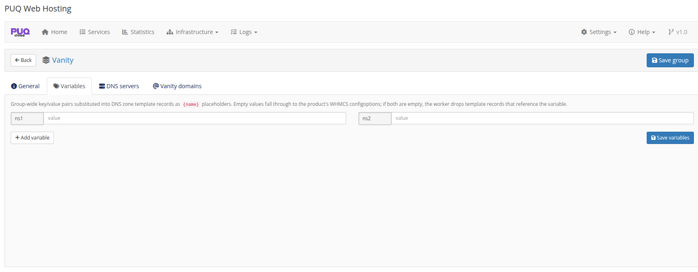

# Setting Up the Vanity Group & Sellable Domains

### PUQ Web Hosting module **[WHMCS](https://puqcloud.com/)**
#####  [Order now](https://puqcloud.com/) | [Download](https://download.puqcloud.com/WHMCS/servers/PUQ_WHMCS-WEB-Hosting/) | [FAQ](https://faq.puqcloud.com/)

A vanity offer is built on a special **server group** whose *purpose* is **Vanity**. This page sets up that group and the parent domains you will sell names on.

## Step 1 — Make a group a Vanity group

Create a server group (Infrastructure → **Server Groups → Add Server Group**), open it, and on the **General** tab set **Group purpose** to **Vanity**.

Switching to Vanity changes the group editor: the hosting‑config tabs disappear and a **Vanity domains** tab appears. A vanity group only has four tabs — **General**, **Variables**, **DNS servers**, **Vanity domains**.

### Reserved names

The General tab has a **Reserved names** box (one per line). These are names customers may **not** register on this group's domains (e.g. `admin2`, your own brand words, etc.). They are enforced on the order form, the client setup page, the API and at provisioning — **on top of** the built‑in technical reservations (`www`, `mail`, `admin`, `ns1`, `_dmarc`, …), which you never need to list yourself.

## Step 2 — Attach DNS servers

On the **DNS servers** tab, tick the nameservers that will carry the subdomain records for this group's domains. Subdomain records are pushed to **every** attached DNS node (active‑active).

If a domain uses **External / wildcard** DNS (next step), the module writes no DNS at all and this selection is irrelevant for that domain.

## Step 3 — Add the parent domains you sell

Open the **Vanity domains** tab. This is the core of the setup. Note the banner restating the safety guarantee — the module only adds/removes the per‑service subdomain, one mailbox, and (in push mode) one DNS record; it never touches the parent mail domain, the zone, or your provider Hestia user.

Click **Add domain** and configure each parent domain:

| Field | What it means |
|-------|---------------|
| **Parent domain** | The domain you own and sell on (e.g. `benchwords.com`). Sold as `name.<domain>` (site) + `name@<domain>` (mailbox). |
| **Mail server** + **Provider mail username** | The **shared** Hestia mail user that already owns the mail domain. **This user must already own the mail domain on HestiaCP before you sell slots on it.** Every customer mailbox is created on this one user. |
| **Mail domain** | Usually the parent domain; leave blank to use it. |
| **DNS mode** | **External / wildcard** — you maintain a `*.domain` wildcard (or manage DNS yourself) and the module touches no DNS. **Push** — the module writes the `name` A/AAAA record into your existing zone. |
| **Web servers** | Which Web nodes may host this domain's sites. The least‑loaded ticked node is chosen at order time. Tick at least one (leave empty only for a mail‑only vanity product). |
| **Status** | `Active (sellable)` to offer it; otherwise hidden from new orders. |

> **DNS mode tip:** a `*.benchwords.com` wildcard A‑record pointing at your web tier is the simplest setup — every new `name.benchwords.com` resolves immediately with zero per‑order DNS work. Use **Push** mode only when you need exact per‑name records in a zone the module manages.

## Step 4 — Variables (optional)

The **Variables** tab works the same as for standard groups — group‑wide `{name}` values used by DNS zone templates. Most vanity setups don't need it (the subdomain record is the only DNS the module writes). Note that a vanity group shows only four tabs — General / Variables / DNS servers / **Vanity domains** — the hosting‑config tabs are hidden.

Once the group has at least one **Active** parent domain with a mail user and a web server, it is ready. The next page wires up the **product** that sells from it.
