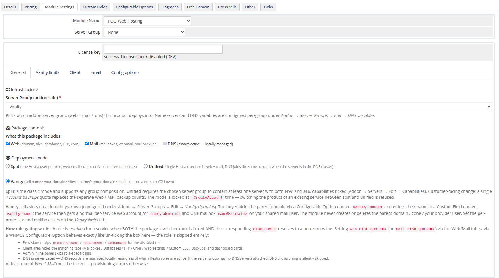
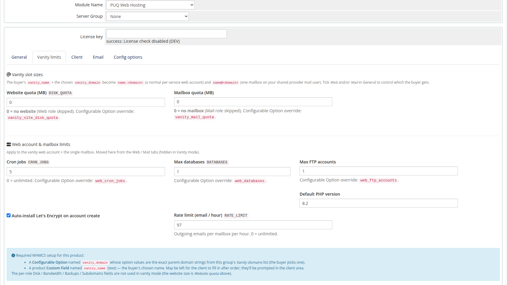
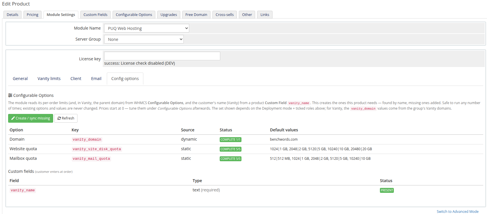
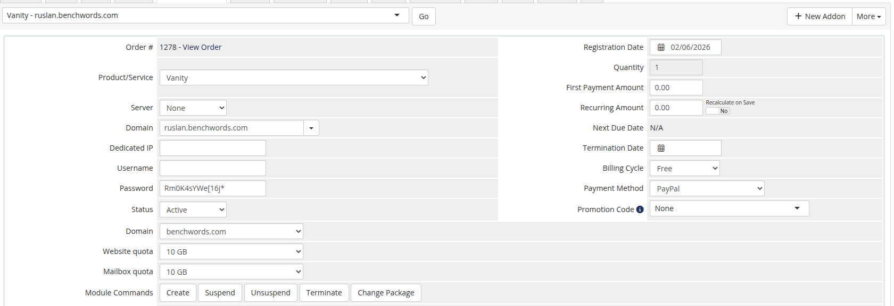

# The Vanity Product

### PUQ Web Hosting module **[WHMCS](https://puqcloud.com/link.php?id=77)**
#####  [Order now](https://puqcloud.com/whmcs-module-web-hosting.php) | [Download](https://download.puqcloud.com/WHMCS/servers/PUQ_WHMCS-WEB-Hosting/) | [FAQ](https://faq.puqcloud.com/)

With the **vanity group** ready (previous page), create a WHMCS product that sells from it. Create a normal product (*Setup → Products/Services*), set its module to **PUQ Web Hosting**, and point its **Server Group** at your vanity group.

## Step 1 — Set the deployment mode to Vanity

On *Module Settings → General*, set **Deployment mode** to **Vanity**. The limits tabs collapse into a single **Vanity limits** tab.

## Step 2 — Vanity limits

The **Vanity limits** tab sets the slot sizes and the per‑slot caps:

| Field | Meaning |
|-------|---------|
| **Website quota** | Disk for the `name.<domain>` website. `0` = no website (skip the web role). |
| **Mailbox quota** | Disk for the single `name@<domain>` mailbox. `0` = no mailbox (mail‑only off). |
| Cron jobs / Max databases / Max FTP / Default PHP | Caps for the website account (same meaning as normal hosting). |
| Auto‑install Let's Encrypt / Rate limit | Auto‑SSL on the website + outbound mail rate limit. |

Tick **Web** and/or **Mail** on the General tab to control which the buyer gets (a website‑only or mailbox‑only vanity product is possible).

## Step 3 — Create the Configurable Options & Custom Field

The product needs two things wired into WHMCS so the order form can expose them:

* a **Configurable Option** named `vanity_domain` (its values are the parent‑domain strings from the group's *Vanity domains* list — this is how the buyer picks which domain), and
* a product **Custom Field** named `vanity_name` (text, required — the buyer's chosen name).

The module creates both for you. Open the **Config options** tab and click **Create / sync missing**:

You'll see `vanity_domain` come up as **dynamic** (its values come straight from your group's sellable domains), the website/mailbox quota options, and the `vanity_name` custom field marked **PRESENT**. It's safe to re‑run any time — existing options and values are never changed. Tune the prices afterwards under WHMCS *Configurable Options*.

## Step 4 — (Optional) client permissions

The **Client** tab toggles which client‑area actions are visible. For vanity, the relevant control is **Mailbox settings — forwards / auto‑responder** (the customer gets one fixed mailbox, so "create/delete mailbox" don't apply). Leave DNS/SSL/backup toggles off for a clean vanity experience.

## What it looks like to your staff

Once a vanity service exists, its WHMCS service page shows the vanity configurable options — the parent **Domain**, **Website quota** and **Mailbox quota** — instead of the full split set:

The product is now ready to sell. The next page walks the **buyer's** experience and the **client area** they get.
