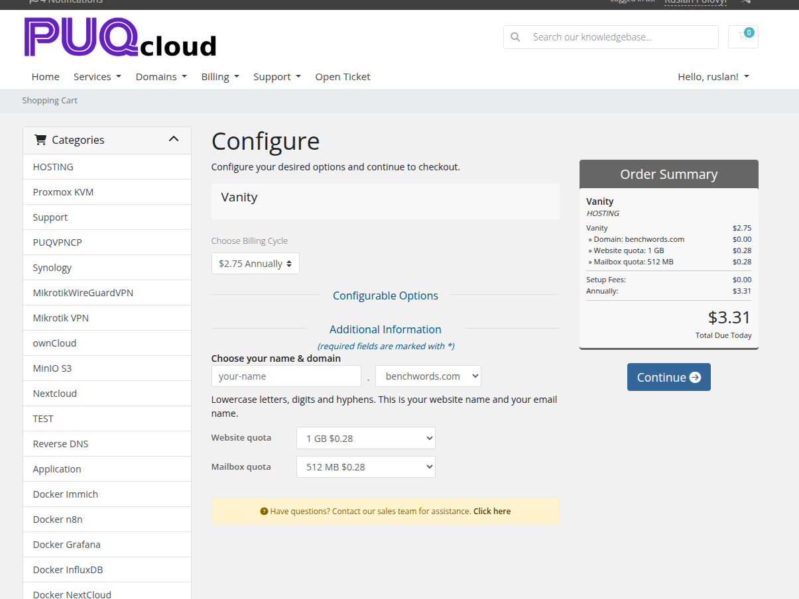
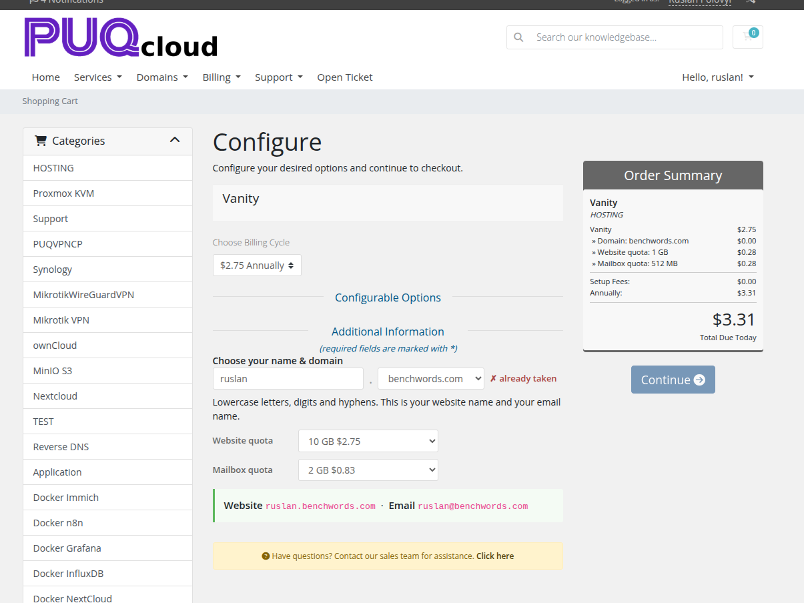
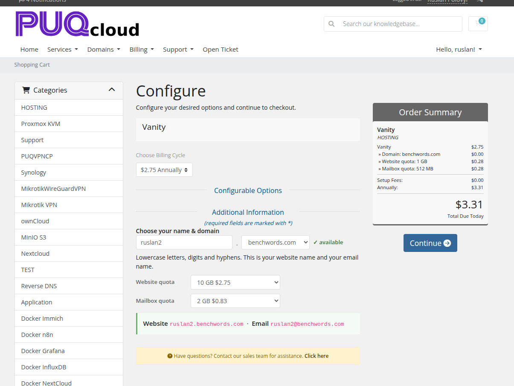
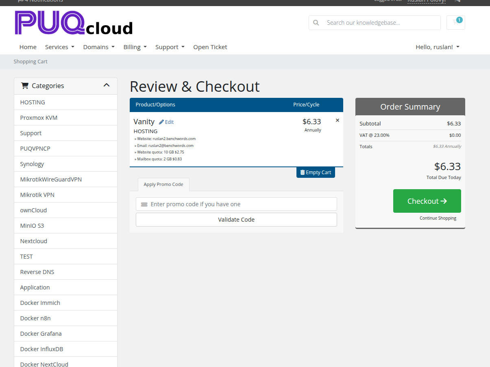
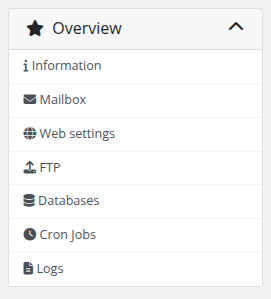
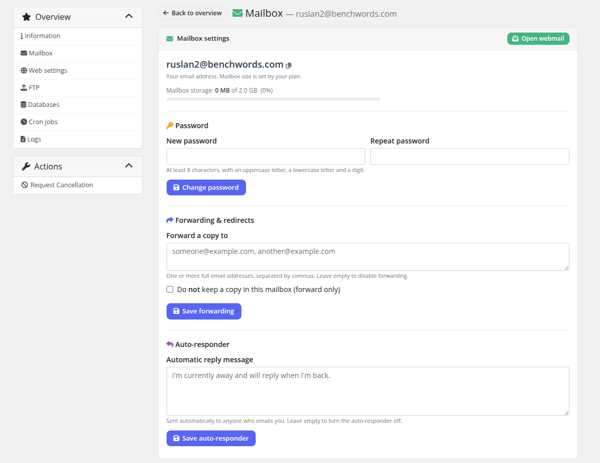
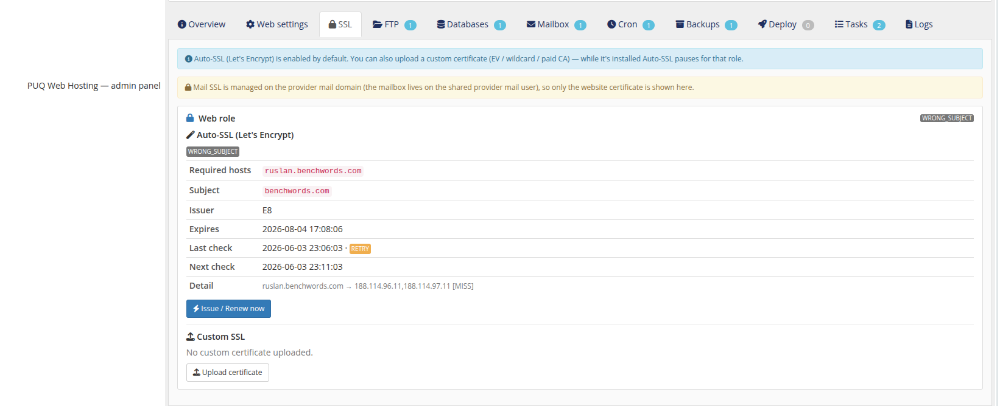

# Vanity: Order & Client Experience

### PUQ Web Hosting module **[WHMCS](https://puqcloud.com/)**
#####  [Order now](https://puqcloud.com/) | [Download](https://download.puqcloud.com/WHMCS/servers/PUQ_WHMCS-WEB-Hosting/) | [FAQ](https://faq.puqcloud.com/)

This page follows a vanity order from the WHMCS cart through to the live customer dashboard.

## On the order form

The vanity product's order form asks the buyer to **choose a name and a domain**, with a single helper line: *“lowercase letters, digits and hyphens — this is your website name **and** your email name.”* Website/mailbox quota dropdowns and a live price summary sit alongside.

As the buyer types, the module checks availability **live** against your API. A taken or reserved name is rejected with the reason, and a live preview shows exactly what they'll get:

A free name turns green and unlocks **Continue**:

## In the cart

At checkout the cart line is human‑readable — it shows the resolved **Website** (`name.domain`) and **Email** (`name@domain`) plus the chosen quotas, so the buyer sees precisely what they're paying for:

## Deployment

After payment the service deploys with the same live splash as any product (web account → mailbox → SSL), then flips to the dashboard. See *Deployment & Segmentation → How deployment works* for the progress screens.

## The vanity client dashboard

The customer lands on a deliberately simple, two‑card dashboard — **Website** and **Email** — each with an *Open* button and a *Settings* button, plus a small usage gauge:

The sidebar is trimmed to only what applies to a slot — **Information, Mailbox, Web settings, FTP, Databases, Cron Jobs, Logs**. There is no DNS editor, no SSL page and no backups page, because those don't apply to a vanity slot:

### The single mailbox page

Because a slot has exactly **one** mailbox, there is no mailbox list — just a **Mailbox settings** page for `name@domain`: storage, change password, forwarding, and an auto‑responder. *Open webmail* is one click.

The customer can still manage their **website** like normal hosting — PHP version & HTTPS (Web settings), FTP accounts, databases, cron jobs and logs — all scoped to their `name.domain` site.

## What your staff see

The admin service panel for a vanity service makes the shared model explicit: the **Website** card shows the per‑service web user and a *"single record on the provider zone (cluster‑managed)"* note; the **Email** card shows the one mailbox on the **shared provider mail user**, and notes that *"Mail SSL is managed on the provider mail domain (not per‑service)."*

The SSL tab confirms it — only the **website** certificate is shown; mail SSL belongs to your provider mail domain, not to each slot:

> Everything the customer does stays inside their own slot. The parent domain, the shared mail account and the DNS zone are never modified per order — exactly as promised on the setup screen.
