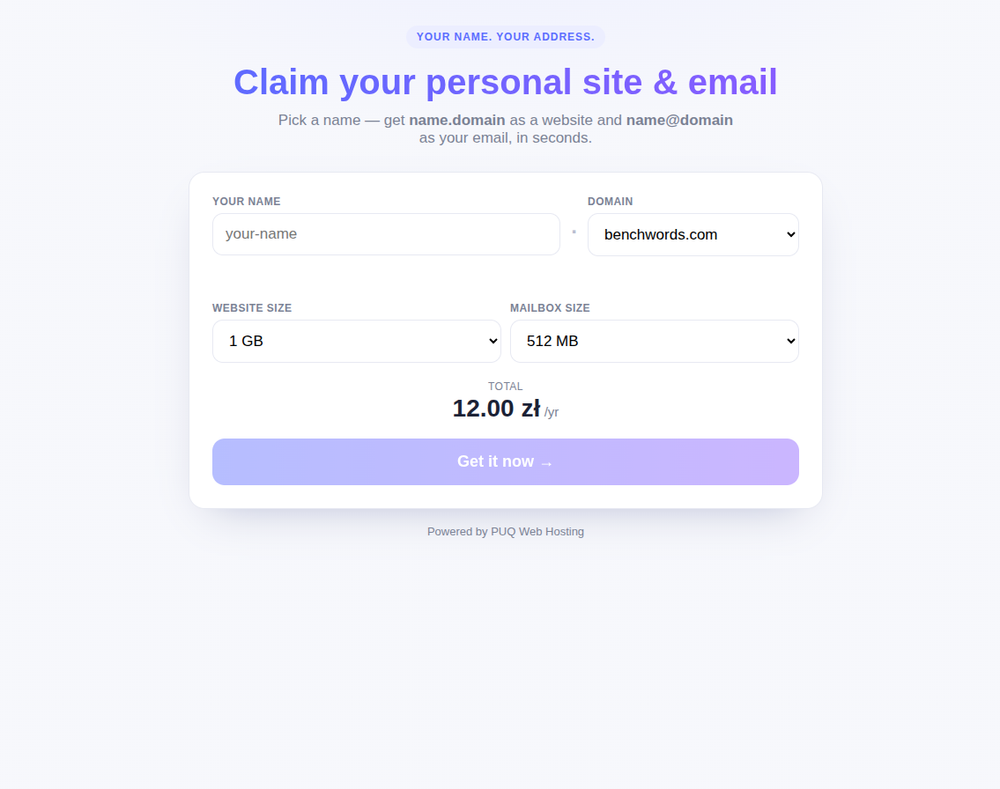
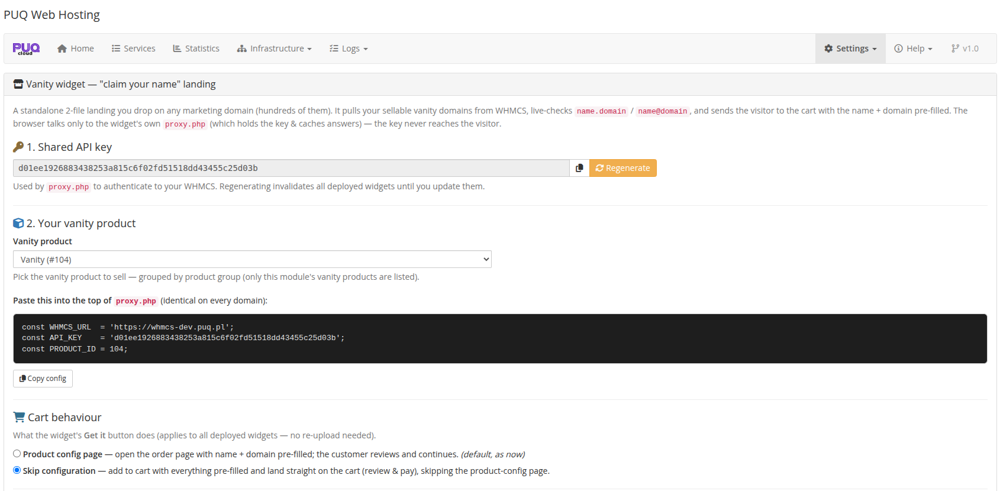
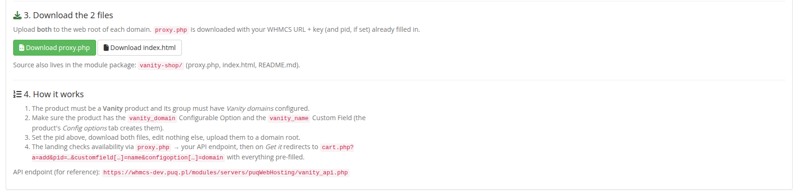
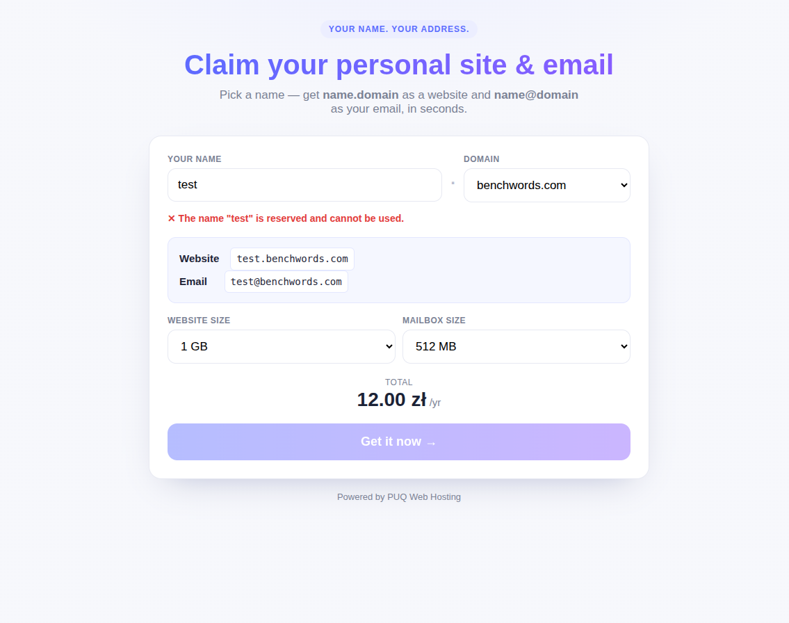
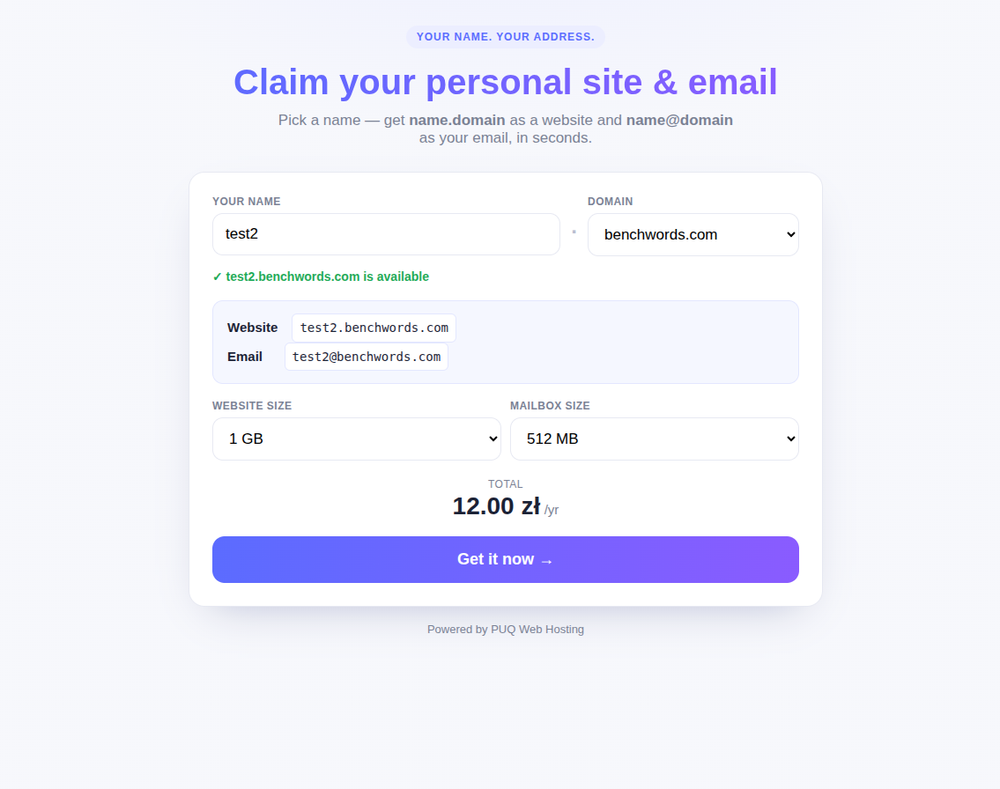
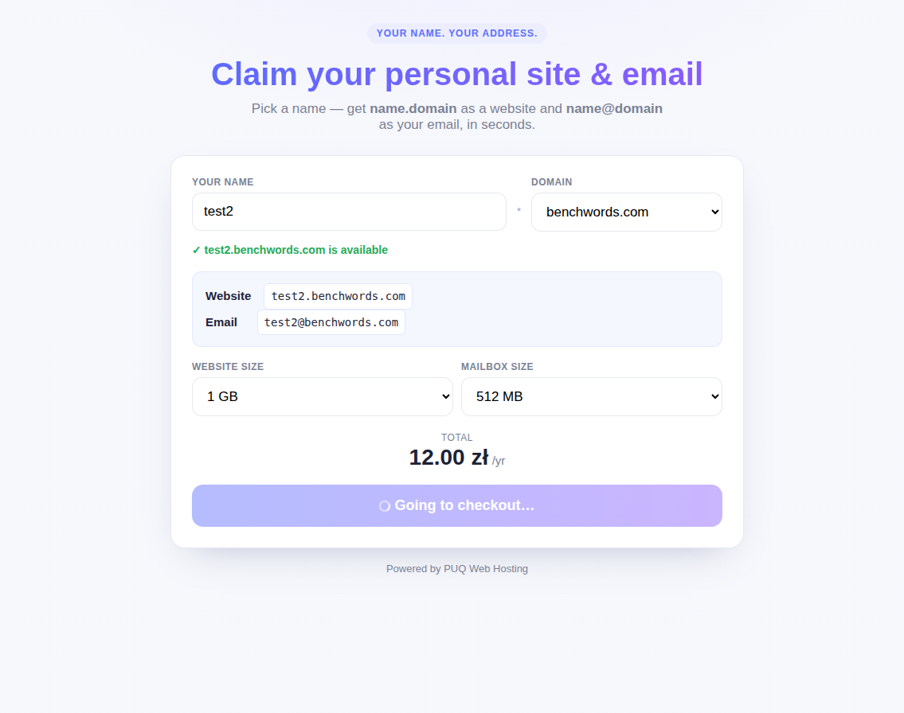
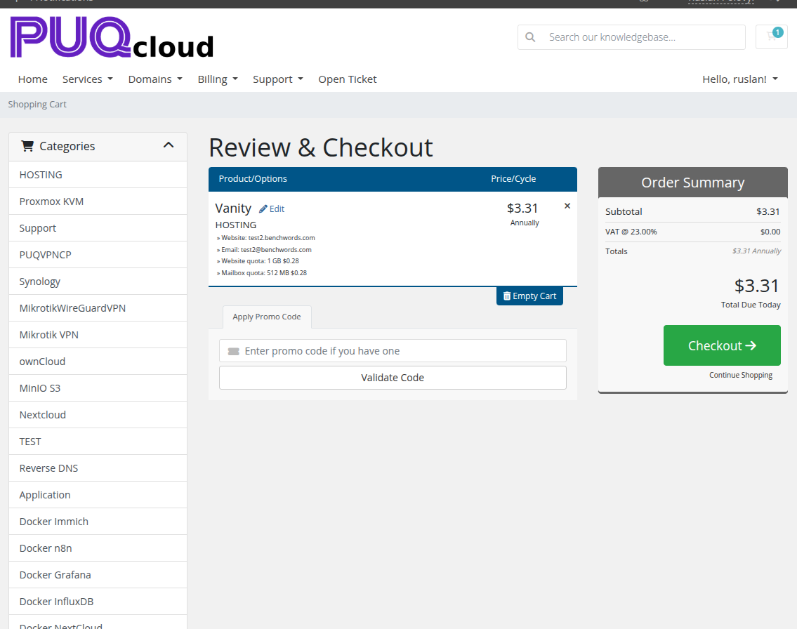

# The Vanity Shop Widget

### PUQ Web Hosting module **[WHMCS](https://puqcloud.com/link.php?id=77)**
#####  [Order now](https://puqcloud.com/whmcs-module-web-hosting.php) | [Download](https://download.puqcloud.com/WHMCS/servers/PUQ_WHMCS-WEB-Hosting/) | [Community](https://community.puqcloud.com/)

Besides selling vanity slots through the normal WHMCS cart, the module ships a **standalone “claim your name” widget** — two small files you can drop on **any** marketing domain (you can deploy it on hundreds of them). It shows a polished landing page that live‑checks names and sends the buyer straight into your prefilled WHMCS cart.

## How it works (and why it's safe)

The widget is just two files — `index.html` (the landing page) and `proxy.php`. The browser talks **only** to the widget's own `proxy.php`, which holds your shared API key and talks server‑to‑server to your WHMCS. **The key never reaches the visitor**, and `proxy.php` caches answers so it stays fast.

* The visitor picks a **name**, a **domain** and the **website / mailbox sizes**; the widget shows a live **total price**.
* As they type, the name is checked live against your WHMCS — reserved/taken names are rejected, free names are accepted with a `name.domain` / `name@domain` preview.
* On **Get it now** the widget redirects the visitor to your WHMCS cart with the product, domain, name and quotas **already filled in**.

## Configure it (addon → Settings → Vanity widget)

In the addon, open **Settings → Vanity widget**:

1. **Shared API key** — used by `proxy.php` to authenticate to your WHMCS. Regenerating it invalidates all deployed widgets until you update them.
2. **Vanity product** — pick the vanity product to sell (grouped by product group; only this module's vanity products are listed).
3. Copy the small **config block** into the top of `proxy.php` (it already contains your WHMCS URL + key + product id).
4. **Cart behaviour** — choose what *Get it now* does: open the normal product‑config page, or **skip configuration** and land straight on the filled cart (review & pay).

Then download the two files and upload both to the web root of each marketing domain:

> **Prerequisites:** the product must be a **Vanity** product whose group has *Vanity domains* configured, and it must have the `vanity_domain` Configurable Option + the `vanity_name` Custom Field (the product's *Config options* tab creates them — see *The vanity product*).

## The buyer's flow on the widget

A **reserved** name is rejected inline, with the live preview:

A free name turns green and enables the button:

On **Get it now** the button shows a spinner while it redirects…

…and the visitor lands on your WHMCS cart with the Vanity product, the website and email, the quotas and the price already filled in — they just pay:

> One vanity product can be fronted by a single WHMCS order form **and** by as many drop‑anywhere widgets as you like — every landing page funnels into the same prefilled cart.
