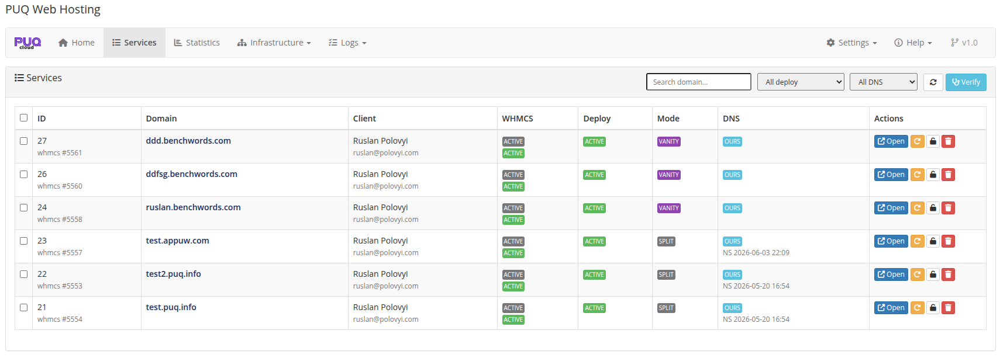
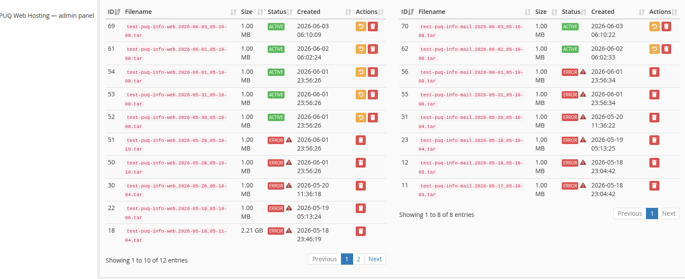
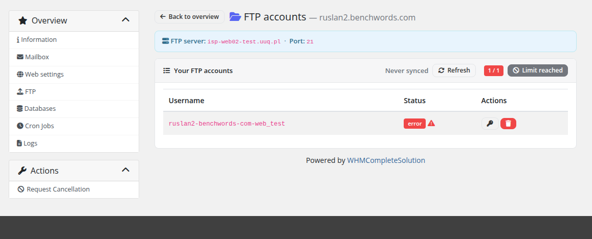
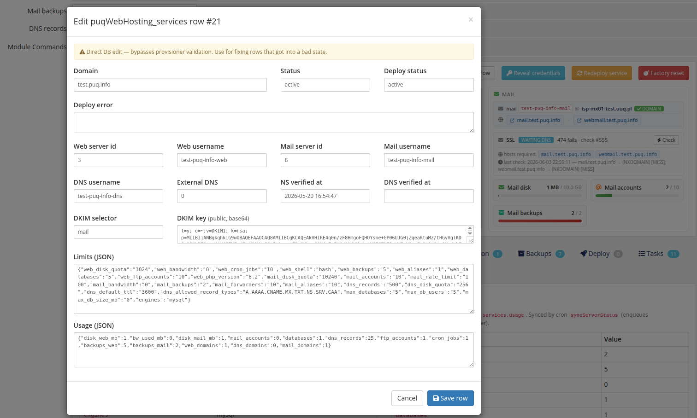
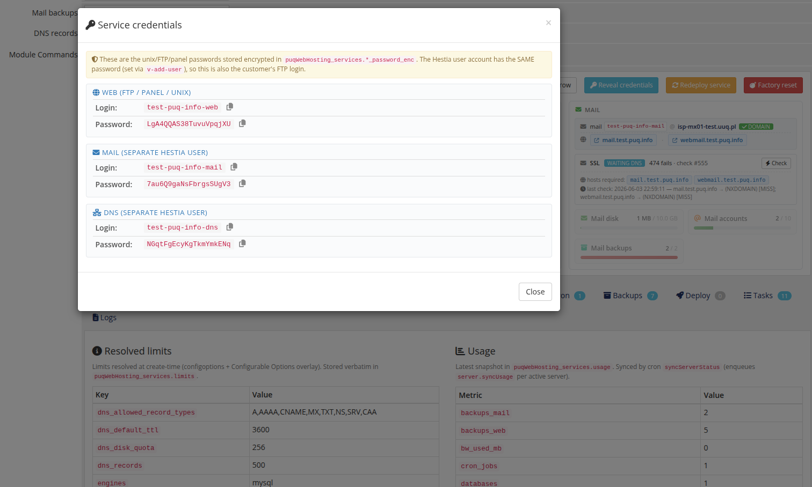

# Common Issues

### PUQ Web Hosting module **[WHMCS](https://puqcloud.com/link.php?id=77)**
#####  [Order now](https://puqcloud.com/whmcs-module-web-hosting.php) | [Download](https://download.puqcloud.com/WHMCS/servers/PUQ_WHMCS-WEB-Hosting/) | [FAQ](https://faq.puqcloud.com/)

Most problems come down to one of: cron not running, a node unreachable over SSH, or DNS not yet pointing. The queue and the per‑service **Verify & Repair** are your main tools.

## Deployment stuck or failed

The customer sees the error screen; the service shows **error** state.

1. Open the service → **Deploy** tab and read the timeline / `deploy_error`.
2. Open **Tasks** and the failed task's detail to see the raw SSH log.
3. Fix the cause (credentials, package, reachable node), then **Redeploy** or **Verify & Repair**.

Common causes: SSH/sudo not set up on the node, wrong server IP, package not yet created, DNS server unreachable.

## A node was unreachable

Tasks for that server pile up. Once it's back, they retry automatically. If a task is permanently wedged, use **Logs → Task Queue → Force‑fail stuck**, then run **Verify & Repair** on the affected services to rebuild what's missing.

## Backups show errors

Backup rows can show an error when the snapshot failed on the server (disk full, Hestia busy). Use **Sync from server** to reconcile the list with reality; missing‑on‑server rows are pruned automatically on sync.

## FTP / DB account won't create (Vanity)

A too‑long suffix on a Vanity service can overflow Hestia's username limit. The username is budget‑aware now, but if you see an *invalid format* error, shorten the suffix.

## A row is in a bad state

For records that got inconsistent (e.g. a half‑created resource), use the service panel's **Edit DB row** to correct the raw record, or **Reveal credentials** to log into Hestia directly and inspect.

## DNS doesn't resolve / SSL won't issue

Auto‑SSL waits for DNS. Confirm the records are published (client **DNS** page → **Verify** for external DNS), give it a propagation cycle, and the fast‑mode SSL worker will pick it up. Check **Settings → SSL** isn't in a freeze window for that domain.

> Golden rule: **is cron running?** Almost every "nothing is happening" report is a cron that isn't firing. Verify the crontab line from **Settings → Cron** is installed.
