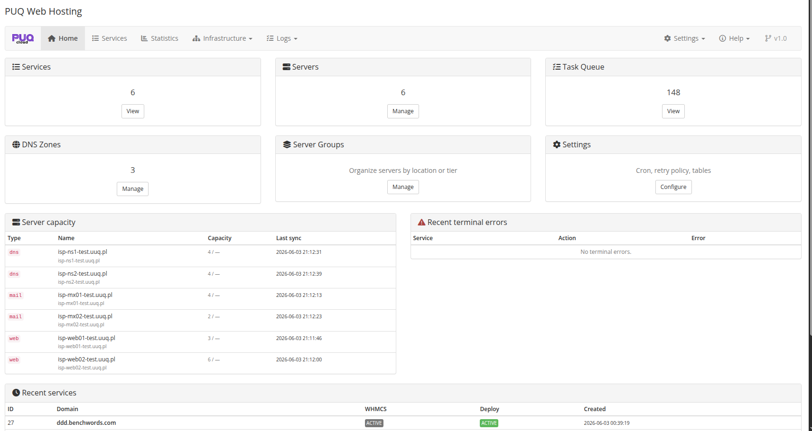

# Description

### PUQ Web Hosting module **[WHMCS](https://puqcloud.com/link.php?id=77)**
#####  [Order now](https://puqcloud.com/whmcs-module-web-hosting.php) | [Download](https://download.puqcloud.com/WHMCS/servers/PUQ_WHMCS-WEB-Hosting/) | [FAQ](https://faq.puqcloud.com/)

## What this module does

**PUQ Web Hosting** is a WHMCS module that fully automates the selling, provisioning, billing and day‑to‑day management of **web hosting and email hosting** accounts on **HestiaCP** servers (with PowerDNS as an additional DNS backend).

From a single WHMCS order the module can create everything a customer needs — a website, databases, FTP accounts, mailboxes, DNS records and an automatic Let's Encrypt certificate — and then expose a clean, self‑service control panel inside the WHMCS client area. Your staff get a powerful admin panel embedded directly in the WHMCS service page, plus a central addon dashboard for your whole server fleet.

The module is built around three ideas that the rest of this documentation explains in detail:

* **Asynchronous, resumable deployment.** A WHMCS order is accepted in milliseconds; the real work runs in a cron‑driven task queue as an idempotent pipeline. Slow panels, network blips and long operations never block the order — failed steps simply retry. See **Cron & Automation → Deploy process**.
* **Server segmentation by role.** Every HestiaCP node has *capabilities* — **Web**, **Mail**, **DNS** — and you organise nodes into **server groups**. You can keep websites on one set of servers, mailboxes on dedicated mail (MX) servers, and DNS on separate nameservers, balancing load by tier and scaling each tier independently. See **Deployment & Segmentation**.
* **Three deployment models, including Vanity.** Sell classic **Split** hosting (a separate Hestia user per role for maximum isolation), simpler **Unified** hosting (one user holds web + mail), or the standout **Vanity** model — turn one domain *you* own into thousands of sellable *“personal site + email”* slots (`name.yourdomain.com` + `name@yourdomain.com`). See **Vanity Mode**.

## Two parts: server module + addon module

The product ships as two WHMCS modules that work together:

| Module | Role |
|--------|------|
| **Server module** (`puqWebHosting`) | The product engine: provisioning, the WHMCS client‑area control panel, and the admin service panel embedded in each service page. |
| **Addon module** (`puq_web_hosting`) | The control centre: a fleet dashboard, the **Infrastructure** pages (web / mail / DNS servers, server groups, DNS zones & templates), module **Settings**, the **task queue** and operation **logs**, and the cron orchestration that drives every deployment. |

The addon module is **required** — it owns the database schema, the task queue and the cron runner that the server module relies on.

## At a glance

* HestiaCP automation over SSH (no panel HTTP API required), plus a PowerDNS DNS driver for mixed clusters.
* Per‑service **websites, databases, FTP, cron jobs, mailboxes (with aliases / forwards / auto‑reply), DNS records** — all self‑service in the client area, all permission‑gated per product.
* **Automatic Let's Encrypt** issuance & renewal for web and mail, plus customer **custom‑certificate** upload.
* Built‑in **file managers** (FileGator + net2ftp) and **phpMyAdmin / webmail** single‑sign‑on links.
* **Backups** (create / list / restore / delete) with per‑role quotas, **per‑domain usage metering**, and WHMCS email events for every lifecycle action.
* Group‑managed **`hestia.conf`** with drift detection, rebrandable **standard files** (error pages, suspended page, robots.txt), and **DNS zone templates** with a full modern mail record set (SPF, DKIM, DMARC, MTA‑STS, TLS‑RPT, autodiscover, CAA).
* The unique **Vanity** model and a standalone **“claim your name” shop widget** you can drop on any marketing domain.

## System Requirements

| Requirement | Supported |
|-------------|-----------|
| **WHMCS** | 8.x or 9.x |
| **PHP** | 7.4, 8.1 or 8.2 *(use the module build that matches your WHMCS host's PHP)* |
| **ionCube Loader** | enabled, matching the host PHP version |
| **HestiaCP** | reachable over SSH (panel HTTP API not required) |
| **PowerDNS** | optional — additional DNS backend |

The module ships as **per‑PHP‑version builds (7.4 / 8.1 / 8.2)**. **WHMCS 8** runs on PHP 7.4, 8.1 or 8.2; **WHMCS 9** runs on PHP 8.2; and on any host with **PHP 8.3 or newer you use the 8.2 build**. Full guidance is in **Installation & Configuration → Requirements & Installation**.

> The pages that follow walk through installation, building your server infrastructure, creating products, and the full admin and client experience — with a dedicated deep‑dive on **server segmentation** and on **Vanity mode**.
